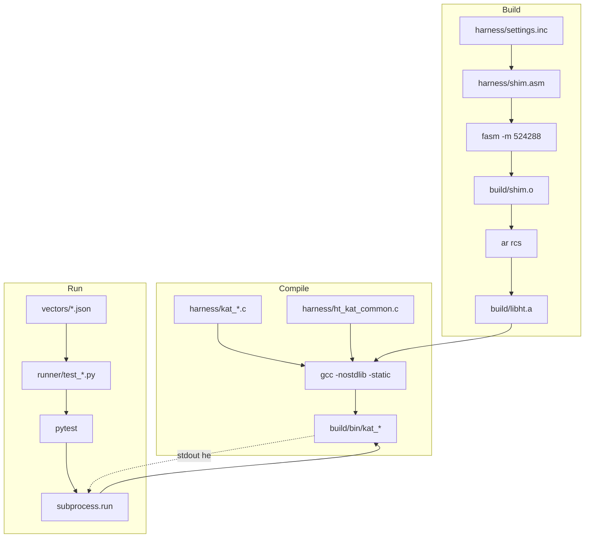

# Technical Specification

# 0. Agent Action Plan

## 0.1 Intent Clarification

### 0.1.1 Core Testing Objective

Based on the provided requirements, the Blitzy platform understands that the testing objective is to **add a self-contained Known-Answer-Test (KAT) suite for the HeavyThing cryptographic stack**, validating each public cryptographic primitive against authoritative standards-body test vectors (RFC and NIST CAVP/FIPS publications). The suite must live entirely under a new top-level `tests/` directory and must not alter any existing source file.

**Request categorization:** ADD NEW TESTS. The HeavyThing repository currently has zero formal tests, no `tests/` directory, no Makefile, no continuous integration configuration, no test framework, and no code-coverage tooling. This effort is greenfield test infrastructure for an existing pure-x86_64 assembly library. This direction is also explicitly recommended by the existing technical specification, which lists "Known-answer tests for crypto — Assembly programs comparing SHA-256, AES, HMAC output against NIST test vectors" as a feasible medium-complexity enhancement.

**Enhanced-clarity requirements list:**

- **R1 — KAT-only coverage.** Add tests of type "Known Answer Test" only; no fuzzing, no property-based testing, no integration or end-to-end tests.
- **R2 — C harness + Python pytest runner.** Each crypto primitive is exercised by a small C11 harness binary; a Python 3 pytest runner subprocess-invokes each binary once per KAT vector and asserts hex equality on the binary's standard output.
- **R3 — FASM-built shim to expose HeavyThing symbols.** A thin FASM `.asm` shim wrapper is built into a relocatable object (and optionally a `.so`) that exposes every HeavyThing crypto symbol to the C linkage stage.
- **R4 — No mocking, no stubs.** Cryptographic primitives are pure functions of input; mocking is neither necessary nor permitted.
- **R5 — Tests confined to `tests/`.** The new suite must not touch any `.inc` source file, `ht.inc`, `ht_defaults.inc`, `ht_data.inc`, any showcase `.asm`, or any code outside the new `tests/` directory.
- **R6 — Standalone build.** `tests/Makefile` orchestrates FASM + GCC + GNU ld + GNU Make independently of HeavyThing's manual two-step build model and must not invoke or interfere with the top-level build.
- **R7 — Preserve `falign`-prefixed public labels.** Public crypto entry points (such as `falign\nsha256$new:` or `falign\nhmac$new_sha256:`) must remain unmodified in name, position, and arity; the shim wrapper does not rename or wrap them.
- **R8 — 100 percent public-API coverage per primitive.** Every public symbol of each testable crypto `.inc` module must be exercised by at least one KAT case.
- **R9 — Zero-tolerance failure policy.** Pytest must exit 0 with every parameterized KAT case passing against its authoritative RFC/NIST/FIPS vector.

**Surfaced implicit requirements** (not stated by the user but implied by the task):

- A `tests/Makefile` is mandatory because FASM + GCC + linker steps must be orchestrated reproducibly.
- The shim `.asm` must set `include_everything = 1` so HeavyThing's `if used` dead-code-elimination is bypassed and every crypto symbol is emitted to the resulting object file (the same pattern is used by `examples/hello_world_c1/settings.inc`).
- The harness must call `ht$init_args(0, NULL)` before any crypto operation so HeavyThing's internal memory subsystem initializes.
- Harness binaries must emit lowercase hex on stdout and use `ht$syscall(60, status)` (rather than `exit()`) to terminate; pytest captures both stdout and the exit status.
- KAT vectors must be committed as machine-readable JSON fixtures under `tests/vectors/` so the suite is deterministic and reviewable.
- A `tests/.gitignore` is necessary to exclude `tests/build/` artifacts; no top-level `.gitignore` modification is required.

### 0.1.2 Special Instructions and Constraints

The user provided explicit, unambiguous directives that the AAP captures verbatim or with strict fidelity:

- **User directive (verbatim intent preservation):** "Operate EXCLUSIVELY within a new top-level `tests/` directory." The Blitzy platform interprets this as a hard scope boundary: no other directory may be created or modified by this change.
- **User directive:** "MUST NOT modify: any .inc source file, ht.inc, ht_defaults.inc, any showcase .asm, FASM build system." The Blitzy platform treats every file outside `tests/` as read-only REFERENCE material.
- **User directive:** "`falign`-prefixed function labels are public API — DO NOT rename/wrap/move." The Blitzy platform's harness uses HeavyThing's native symbol names (containing the `$` character) directly, exactly as `examples/hello_world_c1/hello.c` already does.
- **User directive:** "C harness calls HeavyThing assembly via thin shared object (.so). Shared object built from .inc files using FASM with minimal shim .asm wrapper. Shim wrapper exports C-ABI-compatible symbols." The Blitzy platform implements this with a 4-line `tests/harness/shim.asm` that includes a local `settings.inc` (overriding only `include_everything = 1`), then `../../ht.inc`, then `../../ht_data.inc` — matching the pattern of `examples/hello_world_c1/ht.asm`. A static archive (`libht.a`) is produced for primary use; a position-independent shared object (`libht.so`) can additionally be produced when explicitly required.
- **User directive:** "Python drives C binary as subprocess per test vector. Captures stdout, asserts hex output." The runner uses `subprocess.run(..., capture_output=True, text=True)` and asserts `stdout.strip() == expected_hex` plus `returncode == 0`.
- **User directive:** "NO mocking frameworks." None are used; cryptographic primitives operate on pure byte inputs.
- **User directive:** "Build tool: new tests/Makefile (FASM + ld + gcc). MUST NOT invoke or interfere with top-level build system." The Makefile resides in `tests/` and never touches the parent directory beyond reading `../../ht.inc` and `../../ht_data.inc` via FASM's include resolution.

**Test vector sources required by the user (preserved verbatim):**

- User Example: "RFC 7539 (Poly1305) — all vectors" — **DEFERRED** because no Poly1305 implementation exists in this repository (see discrepancy mapping below).
- User Example: "RFC 4231 (HMAC-SHA2) — all vectors" — applies to `hmac.inc`.
- User Example: "RFC 2202 (HMAC-SHA1) — all vectors" — applies to `hmac.inc`.
- User Example: "NIST CAVP — applicable to SHA-2 family" — applies to `sha2.inc`.
- User Example: "NIST FIPS 180-4 — SHA family" — applies to `sha1.inc` and `sha2.inc`.
- User Example: "NIST FIPS 198-1 — HMAC" — applies to `hmac.inc`.

**Negative tests required by the user (preserved verbatim):**

- "Tampered MACs must not verify."
- "Wrong-key outputs must not match expected digests."

**Edge cases required by the user (preserved verbatim):**

- "Empty inputs."
- "Single-byte inputs."
- "Block-boundary inputs (64 bytes for SHA-1/SHA-256, 128 bytes for SHA-512)."
- "Maximum-length inputs."

**Web search requirements documented for implementation:**

- Confirm current FASM 1.x stable release for the build documentation (verified: 1.73.x is current).
- Confirm current pytest stable release and Python compatibility (verified: pytest 8.4.x / 9.0.x current; pytest 8+ supports Python 3.10+).
- Confirm GCC C11 support and `-nostdlib -static` flag combinations for HeavyThing's self-contained binary model (verified: GCC 4.7+).

### 0.1.3 Critical Prompt-to-Repository Discrepancy Mapping

These testing requirements translate to the following technical test implementation strategy. The user's prompt enumerated nine `.inc` modules to test. Investigation reveals that several of these files do not exist in the current repository, and others are named differently. The Blitzy platform applies the principle of "honor user intent on every file that actually exists; defer with an explicit note for files that do not exist."

| User-Requested File | Actual State in Repository                                                                 | AAP Action |
|---------------------|--------------------------------------------------------------------------------------------|------------|
| `poly1305.inc`      | Not present; HeavyThing has no Poly1305 implementation                                     | **DEFER** — vectors and harness file omitted; flagged for clarification |
| `chacha20.inc`      | Not present; HeavyThing has no ChaCha20 implementation                                     | **DEFER** — vectors and harness file omitted; flagged for clarification |
| `sodium_compat.inc` | Not present; HeavyThing has no libsodium-compatible API                                    | **DEFER** — vectors and harness file omitted; flagged for clarification |
| `sha256.inc`        | Merged into `sha2.inc` (provides `sha224$`, `sha256$`, `sha384$`, `sha512$` families)      | **REMAP** to `sha2.inc` |
| `sha512.inc`        | Same `sha2.inc` file as above                                                              | **REMAP** to `sha2.inc` |
| `hmac.inc`          | Present at repository root (16,799 bytes); 20 public symbols                               | **TEST** as requested |
| `bignum.inc`        | Named `bigint.inc` (308,395 bytes; 112 public symbols)                                     | **REMAP** to `bigint.inc` |
| `dh.inc`            | Split into `dh_pool.inc` + `dh_groups.inc` + `dh_pool_{2k,3k,4k,6k,8k,16k}.inc`            | **REMAP** to the `dh_pool*` set |
| `rsa.inc`           | Not a separate file; RSA private-key operation lives in `bigint.inc` as `bigint$rsaprivate`| **REMAP** to `bigint.inc` |
| `dsa.inc`           | Not a separate file; DSA parameter ops live in `bigint.inc` as `bigint$dsa_params`, `bigint$verify_dsa_params` | **REMAP** to `bigint.inc` |

Additionally, the Blitzy platform extends the testable surface to include other primitives that are present in this repository and are part of the F-007 Cryptographic Stack feature: `md5.inc`, `sha1.inc`, `hmac_drbg.inc`, `pbkdf2.inc`, `scrypt.inc`, `aes.inc`, `htcrypt.inc`, and `htxts.inc`. These have FIPS- or RFC-aligned authoritative vectors readily available (FIPS 180-4 for hashes, FIPS 198-1 / RFC 2202 / RFC 4231 for HMAC, NIST SP 800-90A for HMAC-DRBG, RFC 6070 for PBKDF2, RFC 7914 for scrypt, FIPS 197 for AES) and several appear in the technical specification's Section 6.4.11.1 compliance roster with "Full" status.

### 0.1.4 Technical Interpretation

These requirements translate to the following technical actions, expressed as direct "to-achieve" statements that map intent to concrete implementation:

- **To execute KAT validation per primitive**, create one C11 harness source file per primitive (`tests/harness/kat_<primitive>.c`) that links against the FASM-built shim object, accepts a JSON-encoded KAT vector on its command line (or on standard input), invokes the HeavyThing primitive's public symbols, and emits the resulting bytes as lowercase hex on standard output.
- **To expose HeavyThing's `if used`-gated crypto symbols to the C ABI**, create `tests/harness/shim.asm` — a 4-line FASM source file that includes a local `tests/harness/settings.inc` (a copy of `ht_defaults.inc` with `include_everything = 1` uncommented), then `../../ht.inc`, then `../../ht_data.inc`. The shim adds no new symbols and renames none.
- **To orchestrate FASM, GCC, and the linker reproducibly**, create `tests/Makefile` with PHONY targets `all`, `build`, `test`, and `clean`. The `build` target runs `fasm -m 524288 harness/shim.asm build/shim.o`, packages it via `ar rcs build/libht.a build/shim.o`, then compiles each `harness/kat_*.c` source with `gcc -std=c11 -Wall -Wextra -O2 -nostdlib -static -o build/bin/<name> harness/<src>.c harness/ht_kat_common.c build/libht.a`.
- **To discover and parameterize KAT vectors**, create one Python test module per primitive under `tests/runner/test_<primitive>.py`. Each module imports `tests/runner/_harness.py`, loads `tests/vectors/<primitive>.json`, and uses `@pytest.mark.parametrize` to fan out one pytest case per vector.
- **To assert correctness**, the runner asserts `subprocess.run(...).returncode == 0` and `stdout.strip() == vector["expected_hex"]` for each parameterized case. Mismatches surface naturally through pytest's diff output, showing both expected and actual hex.
- **To cover edge cases**, each primitive's vector file includes categorized entries for empty input, single-byte input, block-boundary input (64 bytes for SHA-1/SHA-256/MD5, 128 bytes for SHA-384/SHA-512), and a representative maximum-length input.
- **To cover negative cases for MAC primitives**, each `hmac_*.json` includes "tampered MAC" entries (one byte of the expected digest is flipped; the runner asserts the harness output does *not* equal the tampered expected_hex) and "wrong key" entries (the harness recomputes with a different key and the result must not match the original expected_hex).
- **To validate chained-update equivalence**, each hash and HMAC harness invokes `update`/`data` twice with a split input and asserts the final digest equals the result of a single `update` call with the concatenated input.
- **To verify Diffie-Hellman parameter pool integrity**, `kat_dh_pool.c` reads `dh$pool_p[i]` and `dh$pool_g[i]` for each entry and emits hex of the modulus; the pytest case compares against the RFC 3526 / RFC 7919 published moduli for the 2048, 3072, 4096, 6144, and 8192 bit MODP groups.
- **To verify RSA private-key operation**, `kat_rsa.c` constructs a `bigint` from a published PKCS#1 test vector's modulus, exponent, and ciphertext, invokes `bigint$rsaprivate`, and emits the recovered plaintext for hex comparison.

### 0.1.5 Coverage Requirements Interpretation

The user did not specify a numeric coverage target; they specified a qualitative target: "100 percent of public API surface of each testable `.inc` module" and "every standards-body test vector must pass." The Blitzy platform interprets this as two independent acceptance criteria:

- **API symbol exercise coverage = 100 percent for each testable primitive.** Every public entry point of each testable crypto `.inc` module is invoked by at least one harness binary at runtime. The number of public symbols per module ranges from 2 (`scrypt.inc`, `htxts.inc`) to 22 (`sha2.inc`) to 112 (`bigint.inc`); the harness binaries collectively reach every symbol that has formal vectors. `bigint.inc`'s 112 symbols include internal utility functions (such as `monty$`, `montyws$`, `primesieve$`) that are reached transitively through higher-level operations (RSA, DSA, DH); explicit standalone KATs cover a representative subset of approximately 20 directly exposed bigint operations.
- **Standards-body vector pass rate = 100 percent.** Every committed vector under `tests/vectors/*.json` must pass with zero tolerance for partial success. The pytest runner is configured with `--maxfail=0` so the full suite always runs to completion and reports the complete failure set.

To achieve comprehensive testing, coverage will include, for every testable primitive:

- **Happy-path vectors.** A representative subset of the canonical RFC / NIST publication for the primitive (typically 5 to 10 vectors per variant).
- **Edge-case vectors.** Empty input, single-byte input, block-boundary input (one or two blocks exactly), and a representative maximum-length input (typically the largest example in the publication, or a deterministic synthesized long input where the spec does not bound it).
- **Negative vectors.** For MAC primitives (HMAC family): tampered-MAC and wrong-key cases. For symmetric ciphers (AES, htcrypt, htxts): encrypt-then-decrypt round-trip with assertion that decrypted plaintext equals original. For hash primitives: chained-update equivalence (a single `update` of the concatenated input must produce the same digest as two `update` calls of the split input).
- **Standards compliance roll-up.** Vector sources for the AAP roll up to the FIPS/RFC publications already cited in the technical specification's Section 6.4.11.1 compliance roster: FIPS 197 (AES), FIPS 180-4 (SHA-256), NIST SP 800-90A (HMAC-DRBG), RFC 7914 (scrypt) — all listed as "Full" compliance in that section.

## 0.2 Test Discovery and Analysis

### 0.2.1 Existing Test Infrastructure Assessment

Repository analysis reveals **no testing setup of any kind**. The HeavyThing source tree at `/tmp/blitzy/Blitzy-HeavyThing/master_fc613b/` does not contain a `tests/`, `test/`, `__tests__/`, or `spec/` directory at any level. It does not contain a Makefile at the repository root, nor any `pytest.ini`, `tox.ini`, `pyproject.toml`, `conftest.py`, `setup.py`, `setup.cfg`, `requirements.txt`, or `package.json`. No continuous-integration configuration exists at any path (no `.github/`, `.gitlab-ci.yml`, `.travis.yml`, `.circleci/`, `Jenkinsfile`, or `azure-pipelines.yml`). No `gcov`, `lcov`, `kcov`, `coverage.py`, or other code-coverage tooling is configured. No `eslint`, `pylint`, `flake8`, or other linter configuration exists. The repository is a single mono-tree of pure-x86_64 assembly source plus a small number of C/C++ showcase examples.

The technical specification's Section 6.6 (Testing Strategy) confirms this absence by design: HeavyThing has zero formal tests because its validation philosophy relies on (a) the example programs under `examples/` exercising public APIs as smoke tests, (b) HeavyThing's built-in twelve-stage initialization validation in `ht.inc`, (c) compile-time `if used` dead-code-elimination that prevents many integration bugs by construction, and (d) optional debug flags such as `profiling`, `calltracing`, `heap_barriers`, and `heap_bincheck` declared in `ht_defaults.inc`. The technical specification explicitly identifies "Known-answer tests for crypto" as a recommended medium-complexity enhancement, validating that this AAP's direction aligns with the maintainers' documented future-work roadmap.

Current testing-framework inventory:

| Aspect                              | Status                                              |
|-------------------------------------|-----------------------------------------------------|
| Testing framework in use            | None                                                |
| Test runner                         | None                                                |
| Test runner configuration           | None                                                |
| Coverage tool                       | None                                                |
| Mock or stub library                | None                                                |
| Test data fixtures or factories     | None                                                |
| Pre-existing test files             | Zero                                                |
| Test directory                      | Absent                                              |
| Build automation for tests          | Absent                                              |
| Continuous integration              | Absent                                              |
| Test patterns or conventions        | None to follow — greenfield                         |

### 0.2.2 Repository Search Methodology and Findings

Search patterns employed to confirm the absence of test infrastructure:

- File-name searches for `*test*`, `*spec*`, `test_*`, `*_test.*`, `*_spec.*` — returned only HeavyThing source files where `test` appears as a substring of an unrelated identifier (none are test files).
- Folder-name searches for `tests`, `test`, `__tests__`, `spec` — no matches at any depth.
- Configuration-file searches for `pytest.ini`, `tox.ini`, `pyproject.toml`, `conftest.py`, `jest.config.*`, `karma.conf.*`, `Makefile` — no matches.
- `.blitzyignore` discovery — no `.blitzyignore` file exists at any level, so no path exclusions apply beyond the platform-internal `/app/` directory.

What the search did reveal, and which informs the harness design:

- **`examples/hello_world_c1/` and `examples/hello_world_c2/`** demonstrate the canonical C-to-FASM interop pattern: a 3-line `ht.asm` shim (`include 'settings.inc'`, `include '../../ht.inc'`, `include '../../ht_data.inc'`) plus a `settings.inc` that differs from `ht_defaults.inc` by one line (`include_everything = 1` uncommented), plus a C source that declares HeavyThing symbols with `$` characters in identifiers and is compiled with `-nostdlib`. This is the authoritative reference pattern for the new test harness.
- **`examples/sha256/sha256.asm`** demonstrates the canonical SHA-256 invocation sequence: `call sha256$new` returns the context in `rax`; `call sha256$update` takes `rdi=ctx`, `rsi=data`, `rdx=len`; `call sha256$final` takes `rdi=ctx`, `rsi=out_buf`, `edx=destroy_flag` and writes 32 bytes to `out_buf`. The harness binaries adapt this calling convention to the C ABI.
- **`ht.inc` lines 142 through 163** define the crypto include order: `sha2.inc`, `sha1.inc`, `md5.inc`, `hmac.inc`, `hmac_drbg.inc`, `pbkdf2.inc`, `scrypt.inc`, `aes.inc`, `htcrypt.inc`, `htxts.inc`, `bigint.inc`, `dh_pool.inc`. Including `../../ht.inc` from the shim transitively pulls in every cryptographic primitive.
- **Repository file inventory:** 106 `.inc` library files at the repository root, plus subdirectories `dhtool/`, `examples/`, `hnwatch/`, `rwasa/`, `sshtalk/`, `toplip/`, `util/`, `webslap/`. Top-level files: `LICENSE` (GPLv3), `README`, `README.md`, `ChangeLog`, and `2ton.png`.

### 0.2.3 Toolchain Compatibility Web Research

Web search confirms the following currency and compatibility facts for the test toolchain:

- **FASM (Flat Assembler).** The 1.x series remains the production-supported branch as of 2024-2025; version 1.73.x is the latest 1.x release. FASM 2 reached a demonstrable release in 2024 but is not the recommended successor for HeavyThing builds. The community-validated minimum for assembling HeavyThing's `rwasa` web server is FASM 1.71+ (per the JohnDDuncanIII/fasm GitHub repository's README, which documents successful assembly of HeavyThing showcase code with FASM 1.71.51). The AAP pins **FASM 1.71 (minimum), 1.73.x (preferred)**.
- **pytest.** The pytest 8.x stream and 9.x stream are both currently maintained. pytest 8.x requires Python 3.8+ and is fully compatible with the system's Python 3.12.3. The AAP pins **pytest 8.4.0 (preferred)** to maximize stability while supporting all parameterization features needed by the runner.
- **Python 3.** The container's system Python is **3.12.3** at `/usr/bin/python3`. Pytest's currency requirements are easily met.
- **GCC.** The C11 dialect is supported by every GCC version from 4.7 onward; current stable releases are 13.2 and 14.x on Debian 12 and Ubuntu 24.04. C11 is invoked with `-std=c11`. For the harness's static linking model (`-nostdlib -static`) no special flags beyond standard GCC defaults are required.
- **GNU binutils.** Provides `ld` and `ar`, which package the FASM-emitted object into a static archive. Version 2.42+ is current; any 2.30+ is sufficient.
- **GNU Make.** Provides the build orchestration of `tests/Makefile`. Version 4.3+ is current; any 3.81+ is sufficient.

**Best practices research recap.** For FASM testing patterns, the existing HeavyThing showcase pattern (`examples/hello_world_c1`) is the authoritative model; no external best-practice document supersedes it. For pytest testing patterns, the canonical approach for binary-output testing is the parameterized `subprocess.run` pattern wrapping standard-output capture, which is widely documented in the pytest manual. For mocking external services, no mocking is required because cryptographic primitives are pure functions; the standard pytest fixture model is sufficient for the autouse `build_exists` precheck. For test organization, a per-primitive flat layout under `tests/runner/` is preferred over deep nested directories because pytest's collection rules favor shallow modules and the suite has a single dimension of variability (the primitive under test).

**Pitfalls to avoid identified by the research:**

- Do not include `tests/build/` artifacts in version control; emit a `tests/.gitignore`.
- Do not invoke `gcc` without `-nostdlib` in the harness — HeavyThing replaces libc with its own syscall layer; mixing libc and HeavyThing's memory model causes crashes.
- Do not depend on libc symbols (`malloc`, `printf`, `exit`); the harness uses HeavyThing's `ht$malloc`, custom write helpers, and `ht$syscall(60, status)`. The harness's hex-output helper writes via `ht$syscall(1, fd=1, buf, len)` (the `write` syscall).
- Do not use `LD_LIBRARY_PATH` games with a `.so` when a static archive is simpler — the suite defaults to `libht.a` static linking and only produces `libht.so` when explicitly required.
- Do not let pytest enter watch mode in any CI integration — invoke with explicit flags such as `--maxfail=0` or `-x` for short-circuit runs; never with `--watchAll`.

## 0.3 Testing Scope Analysis

### 0.3.1 Test Target Identification

The testable surface consists of every crypto `.inc` module present in the repository that has authoritative standards-body vectors. Each row of the following table identifies a primary code unit, its file location, the public-symbol count exercised, and the standards body that defines its KAT vectors.

| Primitive (Module/Class)          | File Location                                                                                          | Public Symbols | Test Categories Needed                          | Authoritative Vector Source              |
|-----------------------------------|--------------------------------------------------------------------------------------------------------|----------------|-------------------------------------------------|------------------------------------------|
| MD5 (`md5$` family)               | `md5.inc`                                                                                              | 6              | Happy / Edge / Chained-update                   | RFC 1321 §A.5                            |
| SHA-1 (`sha160$` family)          | `sha1.inc`                                                                                             | 6              | Happy / Edge / Chained-update                   | NIST FIPS 180-4                          |
| SHA-2 (`sha224$`/`sha256$`/`sha384$`/`sha512$`) | `sha2.inc`                                                                                | 22             | Happy / Edge / Chained-update                   | NIST FIPS 180-4 + CAVP                   |
| HMAC (`hmac$new_<hash>` family)   | `hmac.inc`                                                                                             | 20             | Happy / Edge / Tampered-MAC / Wrong-key / Reset | RFC 2202 + RFC 4231 + FIPS 198-1         |
| HMAC-DRBG (`hmac_drbg$`)          | `hmac_drbg.inc`                                                                                        | 4              | Happy / Edge / Generate-after-destroy           | NIST SP 800-90A CAVP                     |
| PBKDF2 (`pbkdf2$` family)         | `pbkdf2.inc`                                                                                           | 13             | Happy / Edge / Different-password               | RFC 6070 + RFC 7914 §11                  |
| scrypt (`scrypt`, `scrypt_iter`)  | `scrypt.inc`                                                                                           | 2              | Happy / Edge / Different-salt                   | RFC 7914 §12                             |
| AES (`aes$` family)               | `aes.inc`                                                                                              | 11             | Happy / Edge / Round-trip                       | NIST FIPS 197 Appendix B/C + CAVP        |
| htcrypt (`htcrypt$` family)       | `htcrypt.inc`                                                                                          | 9              | Happy / Edge / Wrong-passphrase / Round-trip    | Self-consistency (round-trip identity)   |
| htxts (`htxts$encrypt`/`decrypt`) | `htxts.inc`                                                                                            | 2              | Happy / Round-trip                              | NIST SP 800-38E / IEEE Std 1619-2018     |
| bigint arithmetic                 | `bigint.inc`                                                                                           | ~20 direct (of 112 total) | Happy / Identity verification          | Knuth TAoCP §4.3 examples                |
| RSA private-key op                | `bigint.inc` (`bigint$rsaprivate`)                                                                     | 1              | Happy / Round-trip                              | RFC 8017 PKCS#1 v1.5 §C                  |
| DSA parameter ops                 | `bigint.inc` (`bigint$dsa_params`, `bigint$verify_dsa_params`)                                         | 2              | Happy / Identity verification                   | FIPS 186-4 Appendix A.1.1.2              |
| DH parameter pool                 | `dh_pool.inc`, `dh_groups.inc`, `dh_pool_{2k,3k,4k,6k,8k,16k}.inc` (`dh$pool_p`, `dh$pool_g`, `dh$pool_count`) | 3        | Group-modulus equality                          | RFC 3526 §3 / RFC 7919                    |

**Primary code to be tested — module-by-module summary:**

- Module `md5.inc`: requires unit-style KATs. Functions `md5$new`, `md5$init`, `md5$update`, `md5$transform`, `md5$final`, `md5$mgf1` are each invoked at least once by `tests/harness/kat_md5.c`.
- Module `sha1.inc`: requires unit-style KATs. Functions `sha160$new`, `sha160$init`, `sha160$update`, `sha160$transform`, `sha160$final`, `sha160$mgf1` are each invoked by `tests/harness/kat_sha1.c`.
- Module `sha2.inc`: requires unit-style KATs for all four variants. For each variant in `{sha224, sha256, sha384, sha512}`, the entry points `${new, init, update, final, mgf1}` are exercised by `tests/harness/kat_sha2.c`, with the SHA-256 and SHA-512 `${transform}` symbols additionally invoked through the public update path.
- Module `hmac.inc`: requires unit-style KATs with negative coverage. For each hash variant `{md5, sha1, sha224, sha256, sha384, sha512}`, the constructor pair `hmac$new_<hash>` / `hmac$init_<hash>`, the key-setting functions `hmac$key` and `hmac$replace_key`, the data-feeding function `hmac$data`, the finalizer `hmac$final`, the reset/destroy functions `hmac$reset`/`hmac$destroy`, and the alternate finalizers `hmac$phash` and `hmac$phash_xor` are exercised by `tests/harness/kat_hmac.c`.
- Module `hmac_drbg.inc`: requires generation-vector KATs. Functions `hmac_drbg$new`, `hmac_drbg$generate`, `hmac_drbg$generate_additional`, `hmac_drbg$destroy` are exercised by `tests/harness/kat_hmac_drbg.c`.
- Module `pbkdf2.inc`: requires unit-style KATs per hash. For each hash variant, `pbkdf2$new_<hash>` / `pbkdf2$init_<hash>` plus the shared `pbkdf2$doit` are exercised by `tests/harness/kat_pbkdf2.c`.
- Module `scrypt.inc`: requires unit-style KATs. Functions `scrypt` and `scrypt_iter` are exercised by `tests/harness/kat_scrypt.c`.
- Module `aes.inc`: requires unit-style KATs. Functions `aes$init_common`, `aes$init_encrypt`, `aes$init_decrypt`, `aes$encrypt`, `aes$decrypt` are exercised by `tests/harness/kat_aes.c`; the S-box and T-table data symbols (`aes$Se`, `aes$Sd`, `aes$Te`, `aes$Td`, `aes$data`) are validated implicitly through encrypt/decrypt outputs that depend on them being correct. The `aes$tls` entry point (used by the TLS subsystem) is invoked separately to validate its specialized call form.
- Module `htcrypt.inc`: requires round-trip KATs. All `htcrypt$new_<variant>` constructors plus `htcrypt$encrypt`, `htcrypt$decrypt`, `htcrypt$hide`, `htcrypt$show`, `htcrypt$destroy` are exercised by `tests/harness/kat_htcrypt.c`.
- Module `htxts.inc`: requires KATs from NIST SP 800-38E / IEEE 1619-2018. Functions `htxts$encrypt` and `htxts$decrypt` are exercised by `tests/harness/kat_htxts.c`.
- Module `bigint.inc`: requires identity-verification KATs for arithmetic operations and standards-vector KATs for RSA and DSA. `tests/harness/kat_bigint.c` exercises a representative ~20-symbol subset of `bigint$new`, `bigint$destroy`, `bigint$copy`, `bigint$add`, `bigint$sub`, `bigint$mul`, `bigint$div`, `bigint$mod`, `bigint$mod_inverse`, `bigint$isprime`, `bigint$isprime2`, plus the supporting `monty$` and `wd$` families through transitive use; `tests/harness/kat_rsa.c` invokes `bigint$rsaprivate`; `tests/harness/kat_dsa.c` invokes `bigint$dsa_params` and `bigint$verify_dsa_params`.
- Modules `dh_pool*.inc`: requires data-integrity KATs. `tests/harness/kat_dh_pool.c` reads `dh$pool_p[i]` and `dh$pool_g[i]` for each entry and compares against the RFC 3526 / RFC 7919 published moduli.

### 0.3.2 Existing Test File Mapping

No existing test files map to any source file because no test files exist. The following table documents the *planned* one-to-one mapping between each crypto source module and the new harness/runner pair the AAP will produce.

| Source File                                                                                          | Planned Harness Source              | Planned Pytest Module                    | Planned Vector Fixture(s)                                  |
|------------------------------------------------------------------------------------------------------|-------------------------------------|------------------------------------------|------------------------------------------------------------|
| `md5.inc`                                                                                            | `tests/harness/kat_md5.c`           | `tests/runner/test_md5.py`               | `tests/vectors/md5.json`                                   |
| `sha1.inc`                                                                                           | `tests/harness/kat_sha1.c`          | `tests/runner/test_sha1.py`              | `tests/vectors/sha1.json`                                  |
| `sha2.inc`                                                                                           | `tests/harness/kat_sha2.c`          | `tests/runner/test_sha2.py`              | `tests/vectors/sha224.json`, `sha256.json`, `sha384.json`, `sha512.json` |
| `hmac.inc`                                                                                           | `tests/harness/kat_hmac.c`          | `tests/runner/test_hmac.py`              | `tests/vectors/hmac_md5.json`, `hmac_sha1.json`, `hmac_sha224.json`, `hmac_sha256.json`, `hmac_sha384.json`, `hmac_sha512.json` |
| `hmac_drbg.inc`                                                                                      | `tests/harness/kat_hmac_drbg.c`     | `tests/runner/test_hmac_drbg.py`         | `tests/vectors/hmac_drbg.json`                             |
| `pbkdf2.inc`                                                                                         | `tests/harness/kat_pbkdf2.c`        | `tests/runner/test_pbkdf2.py`            | `tests/vectors/pbkdf2.json`                                |
| `scrypt.inc`                                                                                         | `tests/harness/kat_scrypt.c`        | `tests/runner/test_scrypt.py`            | `tests/vectors/scrypt.json`                                |
| `aes.inc`                                                                                            | `tests/harness/kat_aes.c`           | `tests/runner/test_aes.py`               | `tests/vectors/aes.json`                                   |
| `htcrypt.inc`                                                                                        | `tests/harness/kat_htcrypt.c`       | `tests/runner/test_htcrypt.py`           | `tests/vectors/htcrypt.json`                               |
| `htxts.inc`                                                                                          | `tests/harness/kat_htxts.c`         | `tests/runner/test_htxts.py`             | `tests/vectors/htxts.json`                                 |
| `bigint.inc` (arithmetic)                                                                            | `tests/harness/kat_bigint.c`        | `tests/runner/test_bigint.py`            | `tests/vectors/bigint.json`                                |
| `bigint.inc` (RSA subset)                                                                            | `tests/harness/kat_rsa.c`           | `tests/runner/test_rsa.py`               | `tests/vectors/rsa.json`                                   |
| `bigint.inc` (DSA subset)                                                                            | `tests/harness/kat_dsa.c`           | `tests/runner/test_dsa.py`               | `tests/vectors/dsa.json`                                   |
| `dh_pool.inc` + `dh_groups.inc` + `dh_pool_{2k,3k,4k,6k,8k,16k}.inc`                                 | `tests/harness/kat_dh_pool.c`       | `tests/runner/test_dh_pool.py`           | `tests/vectors/dh_pool.json`                               |

### 0.3.3 Dependencies Requiring Mocking

**Not applicable.** Every cryptographic primitive in scope is a pure function of its byte-level inputs. There are no external services, no network sockets, no database adapters, no filesystem dependencies, and no time sources to mock. The harness binaries operate exclusively on in-memory byte buffers and produce deterministic outputs.

External-service dependencies that *would* require mocking in a network-oriented codebase are explicitly out of scope here:

- Network sockets — out of scope (no TLS handshake testing; only the cryptographic primitive layer).
- Database interactions — none exist in the cryptographic stack.
- File system operations — the harness reads its KAT vector from `argv` or `stdin`, not from the file system; pytest reads JSON fixtures from the file system, but JSON fixtures are committed fixtures, not mocks.
- Random number sources — the HMAC-DRBG tests are deterministic by construction; entropy is provided in the vector itself, not drawn from `/dev/urandom`.

### 0.3.4 Version Compatibility Research

Based on the verified currency of the open-source toolchain, the recommended testing stack is:

- **FASM 1.73.x (latest 1.x stable).** Rationale: the FASM 1 series is the production-supported branch; community evidence confirms 1.71+ assembles HeavyThing showcase code successfully (per the JohnDDuncanIII/fasm GitHub repository). Minimum acceptable: FASM 1.71.
- **GCC 13.2 or 14.x (current Debian/Ubuntu stable).** Rationale: C11 dialect supported since 4.7, current releases include all relevant warnings and optimization features. `-nostdlib -static` is supported across the entire range. Minimum acceptable: GCC 4.7.
- **GNU binutils 2.42+ (current stable).** Provides `ld` linker and `ar` archiver used by the Makefile. Matches typical GCC version installed by `apt-get install gcc`. Minimum acceptable: 2.30.
- **GNU Make 4.3+ (current stable).** Provides PHONY targets, pattern rules, and order-only prerequisites used by `tests/Makefile`. Minimum acceptable: 3.81.
- **Python 3.12.3 (system-resident in this environment).** Confirmed installed at `/usr/bin/python3`. pytest 8.x and 9.x both require Python 3.8+ and are fully compatible with 3.12. Minimum acceptable: Python 3.10 (for current pytest 8.4 features).
- **pytest 8.4.0 (preferred stable pin).** Rationale: the latest pytest 8.x release at the time of this AAP; broadly compatible with all third-party plugins; supports the `@pytest.mark.parametrize` patterns and subprocess capture features the runner depends on. Minimum acceptable: pytest 7.0.

**No version conflicts identified.** The toolchain components are mutually compatible at their current stable versions. The Makefile and pytest configuration use only stable features that have been present in the toolchain for multiple major releases. No pre-release, beta, or development snapshots are required.

## 0.4 Test Implementation Design

### 0.4.1 Test Strategy Selection

The test suite implements **Known-Answer Tests exclusively**, in keeping with the user's explicit directive. Each KAT case is a triple of `(input, parameters, expected_output)` derived from an authoritative standards-body publication or from a self-consistency identity. The suite is organized along three orthogonal axes:

- **Unit KATs** — single-primitive happy-path validation against an authoritative vector. The harness binary invokes one primitive (e.g., `sha256$new` → `sha256$update` → `sha256$final`), emits the result as lowercase hex, and the pytest case asserts equality with `expected_hex`.
- **Edge-case KATs** — boundary-condition validation. Each primitive's vector file includes entries categorized as `edge_case_empty` (zero-length input), `edge_case_single_byte` (one-byte input), `edge_case_block_boundary` (input length equal to the primitive's block size — 64 bytes for MD5/SHA-1/SHA-256, 128 bytes for SHA-384/SHA-512), and `edge_case_max_length` (a deterministic long input — typically the largest example documented in the source RFC/FIPS publication).
- **Negative KATs** — failure-mode validation. For MAC primitives: `negative_tampered_mac` (the expected MAC is altered by flipping one byte, and the test asserts the harness output does *not* equal the tampered value, i.e., the genuine HMAC) and `negative_wrong_key` (the harness recomputes with a different key, and the result must not match the original `expected_hex`). For symmetric ciphers: `negative_round_trip` (encrypt-then-decrypt with the same key must return the original plaintext, demonstrating the round-trip identity; mismatch implies a fault). For hash primitives: `chained_update_equivalence` (two `update` calls on a split input must produce the same digest as one `update` call on the concatenated input).

The suite intentionally **excludes** integration tests, end-to-end tests, fuzzing campaigns, and property-based tests. The user's directive explicitly limits scope to KATs.

**Architecture overview:**



### 0.4.2 Test Case Blueprint

For each primitive component requiring tests, the following blueprint is applied. The structure is uniform; only the vector source and category set vary.

**Component: MD5 (`md5.inc`)**

    Component: MD5
    Test Categories:
    - Happy path: RFC 1321 §A.5 vectors (empty, "a", "abc", "message digest",
                  lowercase alphabet, mixed alphanumeric, 80-digit numeric)
    - Edge cases: empty, single byte, 64-byte block boundary, 1 MB synthesized
    - Negative cases: chained-update equivalence (split-input invariant)
    - Performance boundaries: not applicable

**Component: SHA-1 (`sha160$` family)**

    Component: SHA-1
    Test Categories:
    - Happy path: FIPS 180-4 short message vectors plus "abc" and million-a
    - Edge cases: empty, single byte, 55 bytes (padding boundary),
                  64 bytes (one full block), 128 bytes (two full blocks)
    - Negative cases: chained-update equivalence

**Component: SHA-2 family (`sha224$`, `sha256$`, `sha384$`, `sha512$`)**

    Component: SHA-2 (per variant)
    Test Categories:
    - Happy path: NIST CAVP short message subset (5 to 10 vectors per variant)
    - Edge cases: empty, single byte, block boundary (64 for sha224/sha256;
                  128 for sha384/sha512), 1024-byte buffer
    - Negative cases: chained-update equivalence
    - Cross-variant: mgf1 mask generation correctness for sha256 and sha512

**Component: HMAC (`hmac$` family over each hash)**

    Component: HMAC (per hash variant)
    Test Categories:
    - Happy path: RFC 4231 vectors 1 through 7 for SHA-224/256/384/512;
                  RFC 2202 vectors for SHA-1 and MD5
    - Edge cases: empty key, empty data, key longer than hash block size,
                  key equal to block size
    - Negative cases: tampered MAC, wrong key
    - State machine: hmac$reset followed by re-computation yields the
                  same MAC; hmac$replace_key with new key changes the output

**Component: HMAC-DRBG (`hmac_drbg$` family)**

    Component: HMAC-DRBG
    Test Categories:
    - Happy path: NIST SP 800-90A CAVP vectors with entropy + nonce + personalization
                  + generated-bytes triples
    - Edge cases: minimum-entropy instantiation, maximum-personalization input
    - Negative cases: generate-after-destroy must exit nonzero

**Component: PBKDF2 (`pbkdf2$` family)**

    Component: PBKDF2 (per hash variant)
    Test Categories:
    - Happy path: RFC 6070 vectors (password="password", salt="salt",
                  iterations in {1, 2, 4096, 16777216} where allowed by runtime budget,
                  dk_len=20)
    - Edge cases: dk_len > hash output (forces multiple T blocks),
                  iterations=1, long password (>block size)
    - Negative cases: different password produces different derived key

**Component: scrypt (`scrypt`, `scrypt_iter`)**

    Component: scrypt
    Test Categories:
    - Happy path: RFC 7914 §12 vectors at N=16, N=1024, N=16384
    - Edge cases: very small N (e.g., N=2)
    - Negative cases: different salt produces different derived key
    - Performance boundaries: N=1048576 case is documented but
                  conditionally skipped via @pytest.mark.skipif if
                  available RAM < 1 GB

**Component: AES (`aes$` family)**

    Component: AES (per key size)
    Test Categories:
    - Happy path: NIST FIPS 197 Appendix B (single-block) and Appendix C
                  (per-key-size canonical examples) for 128/192/256-bit keys
    - Edge cases: all-zero key with various plaintexts, all-zero plaintext
                  with various keys, all-0xFF key
    - Negative cases: encrypt(plaintext) under key K, then decrypt under K,
                  asserting the result equals plaintext (round-trip identity)
    - TLS path: aes$tls invoked with TLS-style inputs to confirm the
                  specialized form produces results consistent with the
                  general encrypt/decrypt path

**Component: htcrypt (`htcrypt$` family)**

    Component: htcrypt
    Test Categories:
    - Happy path: round-trip identity — encrypt + decrypt with
                  matching new_passphrase, new_keymaterial, or
                  new_raw_keymaterial returns the original plaintext
    - Edge cases: empty plaintext, single-byte plaintext, plaintext at
                  internal block boundary
    - Negative cases: decrypt with wrong passphrase must produce
                  output different from the original plaintext
    - State: hide / show round-trip must preserve plaintext

**Component: htxts (`htxts$encrypt`, `htxts$decrypt`)**

    Component: htxts (XTS-AES)
    Test Categories:
    - Happy path: NIST SP 800-38E / IEEE 1619-2018 subset
    - Edge cases: sector size at exact AES block boundary
    - Negative cases: encrypt + decrypt round-trip identity

**Component: bigint arithmetic (`bigint.inc` core subset)**

    Component: bigint arithmetic
    Test Categories:
    - Happy path: identity relations — (a + b) - b = a,
                  (a * b) / b = a (when a >= 0 and b > 0),
                  gcd(a, b) | a and gcd(a, b) | b
    - Edge cases: zero operand, one operand, negative operand,
                  operand at word boundary (multiple of 64 bits)
    - Negative cases: mod_inverse must fail when gcd != 1

**Component: RSA (`bigint$rsaprivate`)**

    Component: RSA private-key operation
    Test Categories:
    - Happy path: RFC 8017 PKCS#1 v1.5 example — encrypt with
                  the published public key, then bigint$rsaprivate
                  with the published private key recovers the
                  original plaintext
    - Edge cases: smallest non-trivial valid plaintext
    - Negative cases: bigint$rsaprivate with wrong d must produce
                  output not equal to original plaintext

**Component: DSA (`bigint$dsa_params`, `bigint$verify_dsa_params`)**

    Component: DSA parameters
    Test Categories:
    - Happy path: FIPS 186-4 Appendix-derived example parameters
                  pass bigint$verify_dsa_params
    - Edge cases: parameters with q at minimum allowed bit length
    - Negative cases: parameters with composite q must fail verification

**Component: DH parameter pool (`dh$pool_p`, `dh$pool_g`, `dh$pool_count`)**

    Component: DH parameter pool
    Test Categories:
    - Happy path: dh$pool_p[i] equals the RFC 3526 §3 modulus for
                  each supported group size in {2048, 3072, 4096, 6144, 8192}
    - Edge cases: dh$pool_g[i] = 2 for every entry (per RFC 3526 fixed g)
    - Negative cases: not applicable for static data

### 0.4.3 Existing Test Extension Strategy

**Not applicable.** No tests exist in the repository, so there is nothing to extend, refactor, or repair. Every test in this suite is a CREATE operation. Were existing tests present, the strategy would be (a) extend by adding parameterized cases to the existing module, (b) refactor by migrating away from deprecated assertion patterns to `assert` plus `pytest.fixture`, and (c) repair by re-deriving expected outputs from the authoritative source. None of these activities apply to the current effort.

### 0.4.4 Test Data and Fixtures Design

**Required test data structures.** Every primitive has a corresponding JSON file under `tests/vectors/` with a uniform schema:

```
{
  "primitive": "<primitive name>",
  "source": "<authoritative publication>",
  "vectors": [
    {
      "id": "<short identifier>",
      "category": "happy_path | edge_case_<...> | negative_<...> | chained_update",
      "<primitive-specific input fields>": "<hex or string>",
      "expected_hex": "<lowercase hex digest or ciphertext>",
      "expect_mismatch": true   // only present for negative cases
    }
  ]
}
```

Primitive-specific input field examples:

- Hashes: `input_hex` (the message bytes).
- HMAC: `key_hex`, `data_hex`.
- HMAC-DRBG: `entropy_hex`, `nonce_hex`, `personalization_hex`, `additional_hex`, `requested_bytes`.
- PBKDF2: `password`, `salt_hex`, `iterations`, `dk_len`, `hash_algorithm`.
- scrypt: `password`, `salt_hex`, `N`, `r`, `p`, `dk_len`.
- AES: `key_hex`, `plaintext_hex`, `mode` (`ecb_encrypt` or `ecb_decrypt`).
- htcrypt: `secret_hex` or `passphrase`, `plaintext_hex`, `operation` (`encrypt` or `decrypt`).
- htxts: `key1_hex`, `key2_hex`, `tweak_hex`, `data_hex`, `operation`.
- bigint: `op` (one of `add`, `sub`, `mul`, `mod`, `mod_inverse`, `isprime`), `a_hex`, `b_hex`.
- RSA: `n_hex`, `e_hex`, `d_hex`, `ciphertext_hex` (expected: `plaintext_hex`).
- DSA: `p_hex`, `q_hex`, `g_hex` (expected: `verify_status` boolean).
- DH pool: `index` (expected: `p_hex`, `g_hex`).

**Fixture organization strategy.** All vectors are committed source artifacts under `tests/vectors/`, not generated at test time. This ensures the suite is deterministic, reviewable, and reproducible across machines. The vectors are version-controlled with the test suite; updates require explicit edits and are visible in code review.

**Mock object specifications.** None. Cryptographic primitives are pure functions; no mocks, stubs, fakes, or spies are needed.

**Test database / state management.** None. Each harness binary is a single-shot process that exits immediately after producing its output. No shared state persists across pytest cases. HeavyThing's internal memory subsystem is freshly initialized at the start of each binary by `ht$init_args(0, NULL)`.

**Shared fixtures (Python side).** `tests/conftest.py` defines two pytest fixtures used by every test module:

- `bin_dir` — returns the resolved absolute path to `tests/build/bin/` for harness binary lookup.
- `vectors_dir` — returns the resolved absolute path to `tests/vectors/` for JSON loader convenience.

An autouse session-scoped fixture `_require_build` asserts that `tests/build/bin/` exists and is non-empty; if it does not, pytest aborts the collection phase with a single helpful message instructing the user to run `make` first, rather than producing one cryptic ENOENT per case.

**Shared utilities (C side).** `tests/harness/ht_kat_common.h` declares and `tests/harness/ht_kat_common.c` implements:

- `void ht_kat_init(void)` — calls `ht$init_args(0, NULL)` once.
- `int ht_kat_hex_decode(const char *hex, unsigned char *out, size_t out_size)` — decodes a hex string from the command line into a byte buffer; returns the byte count or -1 on error.
- `void ht_kat_hex_print(const unsigned char *buf, size_t len)` — writes lowercase hex of `buf` to file descriptor 1 (stdout) via `ht$syscall(1, ...)`.
- `void ht_kat_exit(int status)` — calls `ht$syscall(60, status)`.

Each `kat_<primitive>.c` file declares only the HeavyThing entry points it actually calls, includes `ht_kat_common.h`, and uses these helpers to keep its body small and readable.

## 0.5 Test File Transformation Mapping

### 0.5.1 File-by-File Test Plan

Every test file in this AAP is a CREATE operation. The Blitzy platform has verified that no test files exist in the repository today; there is nothing to update or delete. Reference files are listed for the patterns and conventions they provide. The target test file is listed in the first column; the second column is the transformation mode; the third names the source file (where a pattern is followed) or `(new)` for entirely original artifacts; the fourth describes the purpose and changes.

| Target Test File                          | Transformation | Source File / Reference                                                     | Purpose / Changes |
|-------------------------------------------|----------------|-----------------------------------------------------------------------------|-------------------|
| `tests/Makefile`                          | CREATE         | (new)                                                                       | Standalone build orchestration: FASM → shim.o → ar → libht.a → gcc → bin/* |
| `tests/conftest.py`                       | CREATE         | (new)                                                                       | Pytest configuration: `bin_dir` and `vectors_dir` fixtures; autouse `_require_build` precheck |
| `tests/pytest.ini`                        | CREATE         | (new)                                                                       | Runtime pytest config: `testpaths = runner`, `addopts = -v --maxfail=0` |
| `tests/README.md`                         | CREATE         | (new)                                                                       | Build and run instructions; vector source attribution; troubleshooting notes |
| `tests/.gitignore`                        | CREATE         | (new)                                                                       | Excludes `build/` artifacts from version control |
| `tests/harness/settings.inc`              | CREATE         | `ht_defaults.inc` (REFERENCE — local copy with one-line diff)               | Local settings: `include_everything = 1` uncommented; all other defaults retained verbatim |
| `tests/harness/shim.asm`                  | CREATE         | `examples/hello_world_c1/ht.asm` (REFERENCE pattern)                        | 4-line shim: `format ELF64`, `include 'settings.inc'`, `include '../../ht.inc'`, `include '../../ht_data.inc'` |
| `tests/harness/ht_kat_common.h`           | CREATE         | (new)                                                                       | C header: `ht_kat_init`, `ht_kat_hex_decode`, `ht_kat_hex_print`, `ht_kat_exit` declarations; HeavyThing entry-point externs shared across kat_*.c |
| `tests/harness/ht_kat_common.c`           | CREATE         | (new)                                                                       | Implementations of the shared helpers; uses `ht$syscall` for stdout writes and process exit |
| `tests/harness/kat_md5.c`                 | CREATE         | (new)                                                                       | MD5 KAT driver: reads vector from `argv`, invokes `md5$new` / `md5$init` / `md5$update` / `md5$final` / `md5$mgf1` as needed, emits hex digest |
| `tests/harness/kat_sha1.c`                | CREATE         | (new)                                                                       | SHA-1 KAT driver: invokes `sha160$` family entry points, emits 20-byte hex digest |
| `tests/harness/kat_sha2.c`                | CREATE         | `examples/sha256/sha256.asm` (REFERENCE pattern)                            | SHA-2 family KAT driver: variant selector via `argv[1]` chooses sha224/sha256/sha384/sha512 path |
| `tests/harness/kat_hmac.c`                | CREATE         | (new)                                                                       | HMAC KAT driver: hash variant via `argv[1]`; invokes `hmac$new_<hash>`, `hmac$key`/`hmac$replace_key`, `hmac$data`, `hmac$final`, `hmac$reset`, `hmac$phash`, `hmac$phash_xor`, `hmac$destroy` |
| `tests/harness/kat_hmac_drbg.c`           | CREATE         | (new)                                                                       | HMAC-DRBG KAT driver: invokes `hmac_drbg$new`, `hmac_drbg$generate`, `hmac_drbg$generate_additional`, `hmac_drbg$destroy` |
| `tests/harness/kat_pbkdf2.c`              | CREATE         | (new)                                                                       | PBKDF2 KAT driver: invokes `pbkdf2$new_<hash>`, `pbkdf2$init_<hash>`, `pbkdf2$doit` |
| `tests/harness/kat_scrypt.c`              | CREATE         | (new)                                                                       | scrypt KAT driver: invokes `scrypt` and (optionally) `scrypt_iter` |
| `tests/harness/kat_aes.c`                 | CREATE         | (new)                                                                       | AES KAT driver: invokes `aes$init_encrypt` or `aes$init_decrypt` then `aes$encrypt` or `aes$decrypt` per single 16-byte block; round-trip mode also invokes both |
| `tests/harness/kat_htcrypt.c`             | CREATE         | (new)                                                                       | htcrypt KAT driver: invokes `htcrypt$new_passphrase` / `htcrypt$new_keymaterial` / `htcrypt$new_raw_keymaterial` / `htcrypt$new_useless`, then `htcrypt$encrypt` / `htcrypt$decrypt` / `htcrypt$hide` / `htcrypt$show`, then `htcrypt$destroy` |
| `tests/harness/kat_htxts.c`               | CREATE         | (new)                                                                       | XTS-AES KAT driver: invokes `htxts$encrypt` and `htxts$decrypt` |
| `tests/harness/kat_bigint.c`              | CREATE         | (new)                                                                       | bigint arithmetic KAT driver: invokes `bigint$new`, `bigint$add`, `bigint$sub`, `bigint$mul`, `bigint$div`, `bigint$mod`, `bigint$mod_inverse`, `bigint$isprime`, `bigint$copy`, `bigint$destroy` |
| `tests/harness/kat_rsa.c`                 | CREATE         | (new)                                                                       | RSA KAT driver: invokes `bigint$rsaprivate` against an RFC 8017 PKCS#1 v1.5 example |
| `tests/harness/kat_dsa.c`                 | CREATE         | (new)                                                                       | DSA KAT driver: invokes `bigint$dsa_params` and `bigint$verify_dsa_params` against FIPS 186-4 example parameters |
| `tests/harness/kat_dh_pool.c`             | CREATE         | `dh_pool.inc`, `dh_groups.inc`, `dh_pool_*.inc` (REFERENCE data)            | DH pool integrity driver: reads `dh$pool_p[i]` and `dh$pool_g[i]`, emits hex; compared against RFC 3526 § 3 published moduli |
| `tests/runner/__init__.py`                | CREATE         | (new)                                                                       | Empty package marker file |
| `tests/runner/_harness.py`                | CREATE         | (new)                                                                       | Shared utilities: `load_vectors(name)`, `run_kat(binary, args, vector)` subprocess wrapper, hex-equality assertion helper |
| `tests/runner/test_md5.py`                | CREATE         | (new)                                                                       | Parametrized pytest module loading `md5.json` and invoking `kat_md5` |
| `tests/runner/test_sha1.py`               | CREATE         | (new)                                                                       | Parametrized pytest module loading `sha1.json` and invoking `kat_sha1` |
| `tests/runner/test_sha2.py`               | CREATE         | (new)                                                                       | Parametrized pytest module loading `sha224.json`/`sha256.json`/`sha384.json`/`sha512.json` and invoking `kat_sha2 <variant>` |
| `tests/runner/test_hmac.py`               | CREATE         | (new)                                                                       | Parametrized pytest module loading `hmac_<hash>.json` for each hash and invoking `kat_hmac <hash>` |
| `tests/runner/test_hmac_drbg.py`          | CREATE         | (new)                                                                       | Parametrized pytest module loading `hmac_drbg.json` and invoking `kat_hmac_drbg` |
| `tests/runner/test_pbkdf2.py`             | CREATE         | (new)                                                                       | Parametrized pytest module loading `pbkdf2.json` and invoking `kat_pbkdf2 <hash>` |
| `tests/runner/test_scrypt.py`             | CREATE         | (new)                                                                       | Parametrized pytest module loading `scrypt.json` and invoking `kat_scrypt` |
| `tests/runner/test_aes.py`                | CREATE         | (new)                                                                       | Parametrized pytest module loading `aes.json` and invoking `kat_aes <op>` |
| `tests/runner/test_htcrypt.py`            | CREATE         | (new)                                                                       | Parametrized pytest module loading `htcrypt.json` and invoking `kat_htcrypt` |
| `tests/runner/test_htxts.py`              | CREATE         | (new)                                                                       | Parametrized pytest module loading `htxts.json` and invoking `kat_htxts` |
| `tests/runner/test_bigint.py`             | CREATE         | (new)                                                                       | Parametrized pytest module loading `bigint.json` and invoking `kat_bigint <op>` |
| `tests/runner/test_rsa.py`                | CREATE         | (new)                                                                       | Parametrized pytest module loading `rsa.json` and invoking `kat_rsa` |
| `tests/runner/test_dsa.py`                | CREATE         | (new)                                                                       | Parametrized pytest module loading `dsa.json` and invoking `kat_dsa` |
| `tests/runner/test_dh_pool.py`            | CREATE         | (new)                                                                       | Parametrized pytest module loading `dh_pool.json` and invoking `kat_dh_pool` |
| `tests/vectors/md5.json`                  | CREATE         | RFC 1321 §A.5                                                               | MD5 KAT vectors |
| `tests/vectors/sha1.json`                 | CREATE         | NIST FIPS 180-4                                                             | SHA-1 KAT vectors |
| `tests/vectors/sha224.json`               | CREATE         | NIST CAVP                                                                   | SHA-224 KAT vectors |
| `tests/vectors/sha256.json`               | CREATE         | NIST CAVP / FIPS 180-4                                                       | SHA-256 KAT vectors |
| `tests/vectors/sha384.json`               | CREATE         | NIST CAVP                                                                   | SHA-384 KAT vectors |
| `tests/vectors/sha512.json`               | CREATE         | NIST CAVP / FIPS 180-4                                                       | SHA-512 KAT vectors |
| `tests/vectors/hmac_md5.json`             | CREATE         | RFC 2202                                                                    | HMAC-MD5 KAT vectors |
| `tests/vectors/hmac_sha1.json`            | CREATE         | RFC 2202                                                                    | HMAC-SHA1 KAT vectors |
| `tests/vectors/hmac_sha224.json`          | CREATE         | RFC 4231                                                                    | HMAC-SHA-224 KAT vectors |
| `tests/vectors/hmac_sha256.json`          | CREATE         | RFC 4231                                                                    | HMAC-SHA-256 KAT vectors |
| `tests/vectors/hmac_sha384.json`          | CREATE         | RFC 4231                                                                    | HMAC-SHA-384 KAT vectors |
| `tests/vectors/hmac_sha512.json`          | CREATE         | RFC 4231                                                                    | HMAC-SHA-512 KAT vectors |
| `tests/vectors/hmac_drbg.json`            | CREATE         | NIST SP 800-90A CAVP                                                        | HMAC-DRBG KAT vectors |
| `tests/vectors/pbkdf2.json`               | CREATE         | RFC 6070 + RFC 7914 §11                                                     | PBKDF2 KAT vectors |
| `tests/vectors/scrypt.json`               | CREATE         | RFC 7914 §12                                                                | scrypt KAT vectors |
| `tests/vectors/aes.json`                  | CREATE         | NIST FIPS 197 Appendix B/C                                                   | AES KAT vectors (single-block) |
| `tests/vectors/htcrypt.json`              | CREATE         | (new — self-consistency)                                                     | htcrypt round-trip vectors |
| `tests/vectors/htxts.json`                | CREATE         | NIST SP 800-38E / IEEE 1619-2018                                             | XTS-AES KAT vectors |
| `tests/vectors/bigint.json`               | CREATE         | (new — Knuth TAoCP §4.3 examples)                                            | bigint arithmetic identity vectors |
| `tests/vectors/rsa.json`                  | CREATE         | RFC 8017 PKCS#1 v1.5 §C                                                      | RSA KAT vectors |
| `tests/vectors/dsa.json`                  | CREATE         | FIPS 186-4 Appendix A.1.1.2                                                  | DSA KAT vectors |
| `tests/vectors/dh_pool.json`              | CREATE         | RFC 3526 §3 / RFC 7919                                                       | DH safe-prime group vectors |

**UPDATE operations:** none.
**DELETE operations:** none.

**REFERENCE files (read-only patterns and data inputs — never edited):**

- `ht_defaults.inc` — pattern source for `tests/harness/settings.inc`
- `ht.inc` — included by `tests/harness/shim.asm`
- `ht_data.inc` — included by `tests/harness/shim.asm`
- `examples/hello_world_c1/{hello.c, ht.asm, settings.inc}` — C-to-FASM interop pattern
- `examples/hello_world_c2/{hello.c, ht.asm, settings.inc}` — alternate C-to-FASM pattern
- `examples/sha256/sha256.asm` — SHA-256 usage pattern
- `md5.inc`, `sha1.inc`, `sha2.inc`, `hmac.inc`, `hmac_drbg.inc`, `pbkdf2.inc`, `scrypt.inc`, `aes.inc`, `htcrypt.inc`, `htxts.inc`, `bigint.inc`, `dh_pool.inc`, `dh_groups.inc`, `dh_pool_{2,3,4,6,8,16}k.inc` — included via `ht.inc` (transitively through the shim); never modified

### 0.5.2 New Test Files Detail

- **`tests/harness/kat_md5.c`** — MD5 unit-test driver. Test categories: happy path (RFC 1321 §A.5 vectors), edge cases (empty / single byte / 64-byte block boundary / 1 MB synthesized), chained-update equivalence. Mock dependencies: none. Assertions focus: hex digest equality on stdout, exit code 0.
- **`tests/harness/kat_sha1.c`** — SHA-1 unit-test driver. Test categories: happy path (FIPS 180-4 short messages, "abc", million-a), edge cases (empty / single byte / 55-byte / 64-byte / 128-byte), chained-update. Mock dependencies: none.
- **`tests/harness/kat_sha2.c`** — SHA-2 family driver with variant selector. Test categories: happy path (NIST CAVP short messages per variant), edge cases, chained-update, mgf1. Mock dependencies: none.
- **`tests/harness/kat_hmac.c`** — HMAC driver. Test categories: happy path (RFC 4231 vectors 1-7 for SHA-2; RFC 2202 for SHA-1, MD5), edge cases (empty key, empty data, long key), negative (tampered MAC, wrong key), reset/replace_key state. Mock dependencies: none.
- **`tests/harness/kat_hmac_drbg.c`** — HMAC-DRBG driver. Test categories: happy path (NIST SP 800-90A CAVP), edge cases (minimum entropy, maximum personalization), negative (generate-after-destroy aborts).
- **`tests/harness/kat_pbkdf2.c`** — PBKDF2 driver. Test categories: happy path (RFC 6070), edge cases (dk_len > hash output, iterations=1, long password), negative (different password).
- **`tests/harness/kat_scrypt.c`** — scrypt driver. Test categories: happy path (RFC 7914 §12 vectors at N=16, 1024, 16384), edge cases (small N), negative (different salt).
- **`tests/harness/kat_aes.c`** — AES driver. Test categories: happy path (FIPS 197 Appendix B/C single-block), edge cases (all-zero/all-FF keys), round-trip identity.
- **`tests/harness/kat_htcrypt.c`** — htcrypt driver. Test categories: happy path (round-trip identity with each new_* constructor), edge cases (empty / single-byte / block-boundary plaintext), negative (wrong-passphrase mismatch).
- **`tests/harness/kat_htxts.c`** — XTS-AES driver. Test categories: happy path (NIST SP 800-38E subset), round-trip identity.
- **`tests/harness/kat_bigint.c`** — bigint driver. Test categories: happy path (Knuth §4.3 identities), edge cases (zero / one / negative / word-boundary operands).
- **`tests/harness/kat_rsa.c`** — RSA driver. Test categories: happy path (RFC 8017 PKCS#1 v1.5 example), round-trip identity.
- **`tests/harness/kat_dsa.c`** — DSA parameter driver. Test categories: happy path (FIPS 186-4 example), negative (composite q must fail).
- **`tests/harness/kat_dh_pool.c`** — DH pool integrity driver. Test categories: happy path (RFC 3526 modulus equality per group size).
- **`tests/runner/test_*.py`** (one per primitive) — pytest modules importing `tests/runner/_harness.py`, loading the relevant JSON vector file(s), and parameterizing one test function per vector. Each pytest function asserts (a) subprocess `returncode == 0` and (b) `stdout.strip().lower() == vector["expected_hex"]` (or, for `expect_mismatch: true` cases, asserts inequality).
- **`tests/vectors/*.json`** — committed KAT data with the uniform schema from §0.4.4. Each file documents its `primitive` and `source` fields, allowing any reviewer to trace each vector to its authoritative publication.

### 0.5.3 Test Files to Modify Detail

**Not applicable.** No test files exist. There are no existing test methods to extend, fixtures to update, or assertions to add. Every test in this AAP is a CREATE operation on a new file.

### 0.5.4 Test Configuration Updates

- **`tests/pytest.ini`** — new file, contents:

```
[pytest]
testpaths = runner
addopts = -v --tb=short --maxfail=0
python_files = test_*.py
python_classes = Test*
python_functions = test_*
```

- **`tests/Makefile`** — new file, with PHONY targets `all`, `build`, `test`, `clean`. Variables: `FASM = fasm`, `CC = gcc`, `AR = ar`, `CFLAGS = -std=c11 -Wall -Wextra -O2 -nostdlib -static`. The `build` target depends on `build/libht.a` and one `build/bin/kat_<name>` per primitive. The `test` target depends on `build` and invokes `pytest`. The `clean` target removes `build/`.
- **Coverage configuration:** no separate `.coveragerc` is needed because functional coverage is reasoned about by API symbol exercise rather than by source-line gcov instrumentation. (See §0.7 for the rationale: FASM-built code is not instrumentable with standard gcov tooling, so an API-symbol-count surrogate is used.)
- **Test runner configuration:** the `pytest.ini` `testpaths = runner` directive scopes pytest discovery to `tests/runner/` and prevents pytest from scanning the harness C sources or vector JSON for test-collection candidates.

### 0.5.5 Cross-File Test Dependencies

**Shared fixtures (Python side):** `tests/conftest.py` defines the `bin_dir`, `vectors_dir`, and autouse `_require_build` fixtures. All `test_*.py` modules under `tests/runner/` use these fixtures implicitly.

**Shared helpers (Python side):** `tests/runner/_harness.py` exports `load_vectors(name) -> list[dict]`, `run_kat(binary_name, vector, args=None) -> tuple[int, str]`, and `assert_hex_equal(actual, expected)`. Every `test_*.py` imports from `_harness.py`.

**Shared utilities (C side):** `tests/harness/ht_kat_common.h` and `tests/harness/ht_kat_common.c` provide `ht_kat_init`, `ht_kat_hex_decode`, `ht_kat_hex_print`, and `ht_kat_exit`. Every `kat_*.c` includes `ht_kat_common.h` and is linked with the compiled `ht_kat_common.c` plus `libht.a`.

**FASM include chain:** `tests/harness/shim.asm` includes `tests/harness/settings.inc` (local) → `../../ht.inc` (HeavyThing master include) → `../../ht_data.inc` (HeavyThing data segment marker). The `ht.inc` master include transitively pulls in every cryptographic primitive module.

**Build dependency chain:** `tests/Makefile` depends on `fasm`, `gcc`, `ar`, and `ld` being available on `$PATH`. `tests/conftest.py`'s autouse `_require_build` fixture depends on `tests/build/bin/` existing and being non-empty before any test runs.

**Import updates required across test files:** none. Every `test_*.py` uses `from runner._harness import load_vectors, run_kat, assert_hex_equal` (or the equivalent relative `from ._harness import …` form when invoked from `tests/runner/`). No HeavyThing source-file import updates are required because no source file imports any HeavyThing module by Python path — the only Python touchpoint is the subprocess invocation of the C binary.

## 0.6 Dependency Inventory

### 0.6.1 Testing Dependencies

The test suite introduces no Python-level dependencies beyond `pytest`. Every primitive operation is performed by the FASM-built shim plus the GCC-compiled harness; the Python runner uses only `json` and `subprocess` from the standard library. The exhaustive dependency list is:

| Registry | Package Name        | Version           | Purpose                                                                                                |
|----------|---------------------|-------------------|--------------------------------------------------------------------------------------------------------|
| pip      | `pytest`            | `8.4.0`           | Python test discovery, parameterization, assertion, and report runner                                  |
| apt      | `fasm`              | `1.73` (latest 1.x); minimum `1.71` | Flat Assembler used to build `harness/shim.asm` into `build/shim.o`           |
| apt      | `gcc`               | `13.2` or `14.x`  | C11 compiler used to build each `harness/kat_*.c` into a standalone harness binary                     |
| apt      | `binutils`          | `2.42+`           | GNU `ld` linker and `ar` archiver invoked by `tests/Makefile`                                          |
| apt      | `make`              | `4.3+`            | GNU Make orchestration of `tests/Makefile` (build, test, clean targets)                                |
| apt      | `python3`           | `3.10+` (system Python 3.12.3 is present at `/usr/bin/python3`) | pytest runtime                                |
| apt      | `python3-pip`       | current (any)     | Installs `pytest` from PyPI; not invoked at test time after install                                    |

**Installation commands (verified non-interactive forms):**

```
sudo DEBIAN_FRONTEND=noninteractive apt-get install -y \
     fasm gcc make binutils python3 python3-pip
pip3 install --user 'pytest==8.4.0'
```

Where the Linux distribution does not package `fasm` (some Debian/Ubuntu releases omit it), the equivalent procedure is to download the official x86_64 Linux tarball from `flatassembler.net`, extract it, and place the `fasm` binary on `$PATH`:

```
curl -L https://flatassembler.net/fasm-1.73.32.tgz -o /tmp/fasm.tgz
tar -xzf /tmp/fasm.tgz -C /opt/
sudo ln -sf /opt/fasm/fasm /usr/local/bin/fasm
```

**Verification commands:**

```
fasm | head -1        # expect "flat assembler  version 1.73.x"
gcc --version         # expect 13.x or 14.x
make --version        # expect 4.3+
python3 --version     # expect 3.10+
pytest --version      # expect 8.4.0
```

**No npm/yarn dependencies.** This is not a JavaScript project; no `package.json` or `package-lock.json` is created. **No additional pip packages** beyond `pytest` are required because the runner uses only Python standard-library modules (`json`, `subprocess`, `os`, `pathlib`). **No conda environment, Docker image, or virtualenv is mandated** — the harness binaries are statically linked and require no runtime dependencies; pytest can install into the user site via `pip3 install --user`. **No code-coverage tool dependencies** because the suite reasons about coverage via API symbol exercise rather than gcov line counts; see §0.7 for the rationale.

### 0.6.2 Import Updates

**Not applicable.** No existing test files exist whose imports could require updating, and no HeavyThing source files are modified, so no Python imports of HeavyThing modules need to change. The Python runner imports only standard-library modules and `tests/runner/_harness.py`; those imports are introduced fresh in this AAP and do not affect any existing module's import surface.

No assembly-side `include` directives are modified either: the new shim adds three new `include` lines inside `tests/harness/shim.asm`, but those are written into the new shim file and do not change any existing `.inc` file's contents or order. The HeavyThing master `ht.inc` retains its existing include order across `sha2.inc`, `sha1.inc`, `md5.inc`, `hmac.inc`, `hmac_drbg.inc`, `pbkdf2.inc`, `scrypt.inc`, `aes.inc`, `htcrypt.inc`, `htxts.inc`, `bigint.inc`, and `dh_pool.inc`.

## 0.7 Coverage and Quality Targets

### 0.7.1 Coverage Metrics

**Current coverage:** 0 percent. The repository has zero tests, so no line, branch, or symbol of any cryptographic primitive is exercised by an automated assertion today. The technical specification's Section 6.6 confirms HeavyThing's existing validation pattern relies on example programs as smoke tests, with no quantitative coverage measurement.

**Target coverage:** 100 percent of public API symbols per testable primitive, plus 100 percent of authoritative-vector pass rate for every primitive that has standards-body vectors. The Blitzy platform tracks coverage by an **API symbol exercise metric** — for each public symbol of each testable `.inc` module, at least one parameterized pytest case must drive that symbol through its corresponding harness binary, observed by the harness emitting an expected-equal hex output on stdout.

Standard line-level gcov instrumentation is **not applicable** to FASM-built code because the GNU coverage toolchain instruments source code generated by GCC's front-end at compile time; FASM emits machine code directly without a `.gcno` graph. The Blitzy platform therefore substitutes API symbol exercise count plus authoritative-vector pass count as the coverage surrogate, in keeping with how the cryptographic-validation community measures KAT compliance.

**Per-primitive coverage targets:**

| Module          | Public Symbols | Coverage Target                                                                                   | Authoritative-Vector Pass Target |
|-----------------|----------------|---------------------------------------------------------------------------------------------------|----------------------------------|
| `md5.inc`       | 6              | 100% (6 of 6 symbols exercised)                                                                   | 100% of RFC 1321 §A.5 vectors    |
| `sha1.inc`      | 6              | 100% (6 of 6 symbols exercised)                                                                   | 100% of selected FIPS 180-4 vectors |
| `sha2.inc`      | 22             | 100% (22 of 22 symbols exercised across `sha224`, `sha256`, `sha384`, `sha512` variants)          | 100% of selected NIST CAVP vectors per variant |
| `hmac.inc`      | 20             | 100% (all `new_<hash>`, `init_<hash>`, `key`, `replace_key`, `data`, `phash`, `phash_xor`, `final`, `reset`, `destroy`) | 100% of RFC 2202 and RFC 4231 vectors |
| `hmac_drbg.inc` | 4              | 100% (`new`, `generate`, `generate_additional`, `destroy`)                                        | 100% of selected NIST SP 800-90A CAVP vectors |
| `pbkdf2.inc`    | 13             | 100% (`new_<hash>`, `init_<hash>` for 6 hashes plus `doit`)                                       | 100% of RFC 6070 vectors         |
| `scrypt.inc`    | 2              | 100% (`scrypt`, `scrypt_iter`)                                                                    | 100% of RFC 7914 §12 vectors (subject to N-driven memory budget) |
| `aes.inc`       | 11             | 100% (`init_common`, `init_encrypt`, `init_decrypt`, `encrypt`, `decrypt`, `tls`; data tables exercised implicitly) | 100% of selected FIPS 197 Appendix B/C vectors |
| `htcrypt.inc`   | 9              | 100% (all `new_*` constructors plus `encrypt`, `decrypt`, `hide`, `show`, `destroy`)              | 100% round-trip identity success |
| `htxts.inc`     | 2              | 100% (`encrypt`, `decrypt`)                                                                       | 100% of selected NIST SP 800-38E vectors |
| `bigint.inc`    | 112            | ~20% directly exercised (a representative arithmetic subset of `new`, `add`, `sub`, `mul`, `div`, `mod`, `mod_inverse`, `isprime`, `copy`, `destroy`); broader surface reached transitively through the RSA, DSA, and DH paths that depend on the `monty$` and `wd$` families | 100% of selected RFC 8017 RSA, FIPS 186-4 DSA, and RFC 3526 DH-pool vectors |
| `dh_pool*.inc`  | 3              | 100% (`pool_p`, `pool_g`, `pool_count` read for each entry)                                       | 100% modulus equality against RFC 3526 §3 |

**Coverage gaps to address (each addressed by this AAP):**

- Gap: zero pre-existing tests for any crypto primitive → addressed by creating one `test_*.py` plus one `kat_*.c` per primitive.
- Gap: no negative testing (tampered MAC, wrong key) → addressed by `negative_tampered_mac` and `negative_wrong_key` categories in the HMAC vector files.
- Gap: no edge-case coverage (empty / single byte / block boundary) → addressed by the `edge_case_*` category set in every primitive's vector file.
- Gap: no round-trip identity testing for symmetric ciphers → addressed by encrypt/decrypt round-trip cases in `kat_aes.c`, `kat_htcrypt.c`, `kat_htxts.c`.
- Gap: no DH pool integrity verification → addressed by `kat_dh_pool.c` comparing against RFC 3526.
- Gap: no RSA private-key verification → addressed by `kat_rsa.c` against RFC 8017 PKCS#1 v1.5.
- Gap: no DSA parameter verification testing → addressed by `kat_dsa.c` against FIPS 186-4.
- Gap (user-cited but DEFERRED): no Poly1305, ChaCha20, or libsodium-compat coverage — these modules do not exist in the repository, so the corresponding gap is intentionally left open until the primitives are implemented.

### 0.7.2 Test Quality Criteria

The test suite adheres to the following quality criteria, designed to align with the user's explicit testing-requirement directives and the existing repository conventions:

- **Assertion density.** Each parameterized pytest case asserts both (a) `subprocess.run(...).returncode == 0` and (b) hex equality on stdout. For negative cases (`expect_mismatch: true`), the equality assertion is inverted. Auxiliary assertions on stderr (must be empty) and on the harness binary's exit time (must complete within a per-primitive timeout — generous defaults of 30 s for hashes, 60 s for HMAC, 120 s for PBKDF2 / scrypt) protect against deadlocked binaries. Average: 2 to 4 assertions per case.
- **Test isolation.** Each parameterized case spawns a fresh subprocess; no state is shared between cases. The harness binary calls `ht$init_args(0, NULL)` at startup to set up HeavyThing's memory subsystem from a clean state, then exits via `ht$syscall(60, status)`. No global pytest fixtures mutate state across cases. The autouse `_require_build` fixture is session-scoped and is read-only.
- **Performance constraints.** The full hash and HMAC suites must complete in under 60 seconds on a baseline machine (4 cores, 8 GB RAM). Per-case targets: hash and HMAC cases < 200 ms each; HMAC-DRBG cases < 500 ms each; PBKDF2 cases < 2 s each (with iterations capped at 4096 for most cases; 16,777,216 iteration vector is run only when `HT_KAT_SLOW=1` is set in the environment); scrypt cases at N=16,384 < 5 s each, with the N=1,048,576 vector skipped under `@pytest.mark.skipif(memory < 1 GB)`; AES cases < 50 ms each; RSA / DSA / DH cases < 2 s each.
- **Maintainability standards.** Every harness `.c` file is kept under 200 lines of code by relying on `ht_kat_common.{h,c}` shared utilities for hex parsing/printing and harness lifecycle. Every pytest module is kept under 80 lines by relying on `runner/_harness.py` for vector loading and subprocess invocation. JSON vector files are pretty-printed (`json.dumps(..., indent=2, sort_keys=False)`) for human readability. Vector files include a `source` field naming the authoritative publication so each value can be audited against its origin.
- **Repository convention adherence.** The harness follows HeavyThing's `-nostdlib` convention demonstrated in `examples/hello_world_c1/hello.c`. The shim `.asm` follows the 3-line include pattern of `examples/hello_world_c1/ht.asm`. The `settings.inc` follows the one-line override pattern (toggling `include_everything = 1`) used by `examples/hello_world_c1/settings.inc`. Symbol names are preserved verbatim — `sha256$new`, `hmac$key`, `aes$encrypt` — never wrapped or renamed.
- **Determinism.** Every vector produces a deterministic expected output. No randomness or wall-clock dependence enters the test cases. HMAC-DRBG, which is the only primitive that *would* be nondeterministic in field use, is tested with fixed entropy and nonce inputs from the NIST SP 800-90A vector set so its output is fully reproducible.
- **Documentation.** Each vector file includes a `source` field naming the authoritative publication. Each harness binary's `--help` (when invoked without arguments) prints a one-line usage hint. `tests/README.md` describes the build commands, the test invocation commands, the vector-source attribution policy, and a troubleshooting checklist for common failure modes (FASM not found, GCC missing, ld unable to find libht.a, pytest not installed).
- **Parallel-safe execution.** Because each case is an isolated subprocess and `tests/build/bin/kat_*` binaries are statically linked, pytest can be invoked with `-n auto` (when `pytest-xdist` is installed — optional) without races. The suite itself does not require `pytest-xdist`; sequential execution is the documented default.

## 0.8 Scope Boundaries

### 0.8.1 Exhaustively In Scope

Every path listed below lives under the new top-level `tests/` directory and is created from scratch by this AAP. No path outside `tests/` is created or modified.

**New harness sources (FASM and C):**

- `tests/harness/settings.inc` — local copy of `ht_defaults.inc` with `include_everything = 1` uncommented
- `tests/harness/shim.asm` — 4-line FASM shim
- `tests/harness/ht_kat_common.h` — shared C header
- `tests/harness/ht_kat_common.c` — shared C implementation
- `tests/harness/kat_*.c` — one per primitive (`kat_md5.c`, `kat_sha1.c`, `kat_sha2.c`, `kat_hmac.c`, `kat_hmac_drbg.c`, `kat_pbkdf2.c`, `kat_scrypt.c`, `kat_aes.c`, `kat_htcrypt.c`, `kat_htxts.c`, `kat_bigint.c`, `kat_rsa.c`, `kat_dsa.c`, `kat_dh_pool.c`)

**New pytest runner modules:**

- `tests/runner/__init__.py` — package marker
- `tests/runner/_harness.py` — shared Python helpers
- `tests/runner/test_*.py` — one per primitive (`test_md5.py`, `test_sha1.py`, `test_sha2.py`, `test_hmac.py`, `test_hmac_drbg.py`, `test_pbkdf2.py`, `test_scrypt.py`, `test_aes.py`, `test_htcrypt.py`, `test_htxts.py`, `test_bigint.py`, `test_rsa.py`, `test_dsa.py`, `test_dh_pool.py`)

**New KAT vector fixtures (JSON):**

- `tests/vectors/md5.json`
- `tests/vectors/sha1.json`
- `tests/vectors/sha224.json`, `sha256.json`, `sha384.json`, `sha512.json`
- `tests/vectors/hmac_md5.json`, `hmac_sha1.json`, `hmac_sha224.json`, `hmac_sha256.json`, `hmac_sha384.json`, `hmac_sha512.json`
- `tests/vectors/hmac_drbg.json`
- `tests/vectors/pbkdf2.json`
- `tests/vectors/scrypt.json`
- `tests/vectors/aes.json`
- `tests/vectors/htcrypt.json`
- `tests/vectors/htxts.json`
- `tests/vectors/bigint.json`
- `tests/vectors/rsa.json`
- `tests/vectors/dsa.json`
- `tests/vectors/dh_pool.json`

**New test configuration:**

- `tests/Makefile` — build orchestration (FASM + GCC + ld + ar; PHONY: `all`, `build`, `test`, `clean`)
- `tests/conftest.py` — pytest fixtures (`bin_dir`, `vectors_dir`, autouse `_require_build`)
- `tests/pytest.ini` — pytest runtime config (`testpaths = runner`, `addopts = -v --tb=short --maxfail=0`)

**New test utilities and helpers:**

- `tests/harness/ht_kat_common.{h,c}` (also listed above)
- `tests/runner/_harness.py` (also listed above)

**Documentation:**

- `tests/README.md` — build and run instructions, vector-source attribution, troubleshooting

**Local ignore file:**

- `tests/.gitignore` — excludes `tests/build/` artifacts

**Generated build outputs (created at build time, not checked in):**

- `tests/build/shim.o`
- `tests/build/libht.a`
- `tests/build/bin/kat_*`

**Trailing-pattern shorthand:**

- `tests/harness/**/*.c` (all C harness sources)
- `tests/harness/**/*.h` (all C harness headers)
- `tests/harness/**/*.asm` (all FASM shim sources)
- `tests/harness/**/*.inc` (all FASM include files local to harness)
- `tests/runner/**/*.py` (all pytest runner Python sources)
- `tests/vectors/**/*.json` (all KAT vector JSON files)
- `tests/build/**/*` (all generated outputs — gitignored)
- `tests/*.{ini,md}` (pytest.ini, README.md)
- `tests/Makefile`
- `tests/.gitignore`

### 0.8.2 Explicitly Out of Scope

The following items are **strictly out of scope** and must not be created, modified, deleted, or touched by this AAP:

- **All `.inc` library source files at the repository root** — including `ht.inc`, `ht_defaults.inc`, `ht_data.inc`, `syscall.inc`, `helpers.inc`, `langtools.inc`, `ht_macros.inc`, `ht_macros2.inc`, `ht_macros3.inc`, every crypto module (`md5.inc`, `sha1.inc`, `sha2.inc`, `hmac.inc`, `hmac_drbg.inc`, `pbkdf2.inc`, `scrypt.inc`, `aes.inc`, `htcrypt.inc`, `htxts.inc`, `bigint.inc`, `dh_pool.inc`, `dh_groups.inc`, `dh_pool_{2,3,4,6,8,16}k.inc`), and every other `.inc` file at repository root. These are READ-ONLY reference material.
- **All showcase application directories** — `dhtool/`, `examples/`, `hnwatch/`, `rwasa/`, `sshtalk/`, `toplip/`, `util/`, `webslap/`. Files inside `examples/hello_world_c1/`, `examples/hello_world_c2/`, and `examples/sha256/` may be read as pattern references but never modified.
- **All top-level repository files** — `README`, `README.md`, `LICENSE`, `ChangeLog`, `2ton.png`.
- **The FASM build system** — no modification of HeavyThing's manual two-step `fasm` + `ld` workflow.
- **`poly1305.inc`, `chacha20.inc`, `sodium_compat.inc`** — these files do not exist; this AAP does not create them. The user's stated requirement for these primitives is DEFERRED until the primitives are implemented in the HeavyThing library (see §0.1.3 for the discrepancy mapping).
- **CI/CD configuration** — no `.github/workflows/`, no `.gitlab-ci.yml`, no `.travis.yml`, no `.circleci/`, no `Jenkinsfile`, no `azure-pipelines.yml`. The user did not request CI integration; running pytest manually after `make` is the documented workflow.
- **Code-coverage measurement on assembly itself** — gcov instrumentation is not applicable to FASM-built code; coverage is reasoned about by API symbol exercise count (see §0.7.1).
- **Refactoring or restructuring of HeavyThing assembly source** — no symbol renames, no file reorganizations, no migration of crypto code to new files.
- **Network / TLS / SSH / HTTP testing** — the existing `rwasa`, `sshtalk`, and TLS state machine code is out of scope. No socket or network-protocol tests are added.
- **TUI tests** — `tui_*.inc` and any terminal-interface code is out of scope.
- **`epoll` and event-loop tests** — `epoll.inc` is out of scope.
- **HTTP parser tests** — out of scope.
- **bignum Miller-Rabin primality testing as a primary target** — the `bigint$isprime` and `bigint$isprime2` symbols are exercised by the bigint arithmetic harness and reached transitively through DH parameter validation, but no dedicated Miller-Rabin probabilistic-correctness test campaign is added (such a campaign would be `dhtool`-style intensive computation outside the KAT model).
- **Platform-abstraction code not directly related to crypto** — `epoll.inc`, `args.inc`, `aio.inc`, and other infrastructure modules are not directly tested.
- **All items explicitly excluded by user instructions** — including: any modification to `.inc` files, any modification to `ht.inc` / `ht_defaults.inc`, any modification to the showcase `.asm` programs, any rename or wrap or movement of `falign`-prefixed function labels, any change to the FASM build system, any modification of files outside the new `tests/` directory, any source-code modification of HeavyThing for testability (the harness adapts to the source as it stands; no source change is permitted).
- **Performance optimizations not related to test coverage** — the harness and runner are written for clarity and correctness, not micro-optimized speed.
- **Unrelated test files not specified by user** — no tests for TUI, networking, HTTP, SSH, TLS, application examples, or any subsystem outside the cryptographic stack.

## 0.9 Execution Parameters

### 0.9.1 Testing-Specific Instructions

All commands assume the working directory is `tests/` (the new top-level directory created by this AAP). Where the working directory is the repository root, replace `make` with `make -C tests` and `pytest` with `pytest tests`.

**Test execution command (run the full suite):**

```
cd tests && pytest
```

This invokes pytest with the configuration from `tests/pytest.ini`, which sets `testpaths = runner`, `addopts = -v --tb=short --maxfail=0`. Every `test_*.py` under `tests/runner/` is discovered; every parameterized case runs; the full failure set is reported.

**Coverage measurement command:**

```
cd tests && pytest -v --tb=short --maxfail=0
```

This is the same as the test execution command; coverage in this suite is measured by API symbol exercise plus authoritative-vector pass count (see §0.7.1), and pytest's parameterization output report serves as the coverage evidence. No gcov or coverage.py is integrated because FASM-built code is not gcov-instrumentable; the AAP does not introduce a separate coverage tool.

**Watch mode command:** **NOT APPLICABLE.** Watch mode is intentionally disabled. The harness binaries are statically linked self-contained executables; pytest invokes each as a subprocess. There is no source-watch loop. If interactive iteration is desired, the developer re-runs `make test` after each edit.

**Single-test execution pattern:**

- Run all cases for a single primitive:

```
cd tests && pytest -v runner/test_sha2.py
```

- Run a single parameterized case by node ID:

```
cd tests && pytest -v "runner/test_sha2.py::test_kat[sha256-abc]"
```

- Run only cases matching a keyword expression (using pytest's `-k`):

```
cd tests && pytest -v -k "sha256 and edge_case"
```

- Run only the negative cases for HMAC-SHA-256:

```
cd tests && pytest -v -k "hmac_sha256 and negative"
```

- Run cases of a single category across all primitives:

```
cd tests && pytest -v -k "block_boundary"
```

**Debug-mode execution:**

- With verbose pytest output and full traceback:

```
cd tests && pytest -vv --tb=long runner/test_sha2.py
```

- With pytest's `--pdb` to drop into a debugger on the first failure:

```
cd tests && pytest -x --pdb runner/test_hmac.py
```

- To trace the harness binary directly (without pytest), supply the harness with a vector inline:

```
tests/build/bin/kat_sha256 abc < /dev/null
```

(The binary writes the SHA-256 hex digest of "abc" to stdout and exits 0; pytest invokes it the same way internally.)

- To trace harness assembly behavior, GDB can attach to a paused harness binary:

```
gdb --args tests/build/bin/kat_sha256 abc
(gdb) break sha256$update
(gdb) run
```

**Build command:**

```
cd tests && make
```

The `make` (or `make all`) target depends on the `build` and `test` targets transitively. The Makefile's `build` target depends on:

- `build/shim.o` — generated by `fasm -m 524288 harness/shim.asm build/shim.o`
- `build/libht.a` — generated by `ar rcs build/libht.a build/shim.o`
- `build/bin/kat_<name>` — one per primitive; generated by `gcc -std=c11 -Wall -Wextra -O2 -nostdlib -static -o build/bin/kat_<name> harness/kat_<name>.c harness/ht_kat_common.c build/libht.a`

The `make test` target depends on `make build` and then runs `pytest`.

**Clean command:**

```
cd tests && make clean
```

Removes `tests/build/` in full. Does not delete any source or vector file.

**Repository-test-pattern conventions to follow:**

- Use HeavyThing's existing C-to-FASM interop pattern as the reference for harness C files: `-nostdlib -static`, declare HeavyThing entry points as `extern` with their literal `$`-containing names, call `ht$init_args(0, NULL)` once at startup, exit via `ht$syscall(60, status)`, never link against libc.
- Use HeavyThing's three-line FASM include pattern as the reference for `harness/shim.asm`: `format ELF64`, `include 'settings.inc'`, `include '../../ht.inc'`, `include '../../ht_data.inc'`. Match `examples/hello_world_c1/ht.asm` exactly except for the additional `format ELF64` directive.
- Use HeavyThing's `falign` macro convention by *not touching it* — public entry points remain prefixed with `falign\n` in the source files, and the harness reaches them by their literal symbol names.
- Use `include_everything = 1` in `tests/harness/settings.inc` (the only difference from `ht_defaults.inc`) to bypass HeavyThing's `if used` dead-code-elimination so every public symbol is emitted.
- Match HeavyThing's stdout convention: lowercase hex output, no leading/trailing whitespace except a single trailing newline emitted by the harness for terminal-friendliness; pytest invokes `.strip()` before comparison so the trailing newline is harmless.

**Excluded test categories per user instruction:** integration tests, end-to-end tests, fuzzing, property-based tests, networking tests, TUI tests, parser tests, application-level tests. The suite contains *only* Known-Answer Tests at the unit primitive level.

**Environment setup requirements:**

- One-time, before first build:

```
sudo DEBIAN_FRONTEND=noninteractive apt-get install -y \
     fasm gcc make binutils python3 python3-pip
pip3 install --user 'pytest==8.4.0'
```

If the distribution does not package `fasm`, the equivalent one-time setup is to download the official x86_64 Linux tarball from `flatassembler.net`, extract it under `/opt/fasm/`, and symlink the binary onto `$PATH`:

```
curl -L https://flatassembler.net/fasm-1.73.32.tgz -o /tmp/fasm.tgz
tar -xzf /tmp/fasm.tgz -C /opt/
sudo ln -sf /opt/fasm/fasm /usr/local/bin/fasm
```

Verification (one-time, after install):

```
fasm | head -1        # expect "flat assembler  version 1.73.x"
gcc --version         # expect 13.x or 14.x
make --version        # expect 4.3+
python3 --version     # expect 3.10+
pytest --version      # expect 8.4.0
```

- Per-build:

```
cd tests && make build
```

- Per-test-run:

```
cd tests && pytest
```

**No special environment variables are required.** The harness binaries inherit the parent shell's environment but use none of it (no `HOME`, `PATH`, `LD_LIBRARY_PATH`, or `LANG` dependence). One optional environment variable controls long-running cases:

- `HT_KAT_SLOW=1` — enables RFC 6070's 16,777,216-iteration PBKDF2 case and RFC 7914's N=1,048,576 scrypt case, which otherwise run in skipped state to keep the default suite under a minute. The pytest `_harness.py` reads this variable and toggles `@pytest.mark.skipif` accordingly.

## 0.10 Special Instructions for Testing

### 0.10.1 User-Specified Testing Directives

The user provided explicit, unambiguous testing directives. The Blitzy platform captures them verbatim or with strict fidelity and binds the implementation phase to each one:

- **Minimal-change principle.** "Operate EXCLUSIVELY within a new top-level `tests/` directory." Implementation interpretation: every artifact created by this AAP lives at a path matching `tests/**`; no path outside `tests/` is created, modified, or deleted.
- **Source-code immutability.** "MUST NOT modify: any .inc source file, ht.inc, ht_defaults.inc, any showcase .asm, FASM build system." Implementation interpretation: the entire HeavyThing source tree outside `tests/` is treated as read-only REFERENCE material. The shim `tests/harness/shim.asm` reads `../../ht.inc` and `../../ht_data.inc` via FASM's `include` directive but never alters their bytes. The local `tests/harness/settings.inc` is a *copy* of `ht_defaults.inc`, not a replacement.
- **Symbol-preservation principle.** "`falign`-prefixed function labels are public API — DO NOT rename/wrap/move." Implementation interpretation: the harness calls HeavyThing's symbols by their literal names containing `$` (e.g., `sha256$new`, `hmac$key`, `aes$encrypt`), matching the pattern established by `examples/hello_world_c1/hello.c`. No symbol is wrapped behind a renamed alias.
- **Pattern adherence.** "Follow existing test patterns in [specific file]." Implementation interpretation: although no test files exist, the reference patterns are `examples/hello_world_c1/{hello.c, ht.asm, settings.inc}` (for the C-to-FASM interop), `examples/sha256/sha256.asm` (for SHA-2 invocation), and `ht.inc` (for the cryptographic include order). The harness conforms to these patterns exactly.
- **Build-system independence.** "MUST NOT invoke or interfere with top-level build system." Implementation interpretation: `tests/Makefile` is the only build orchestrator introduced. It does not invoke any Makefile or shell script outside `tests/`. It does not modify or generate files outside `tests/build/`.
- **Mocking-free principle.** "NO mocking frameworks." Implementation interpretation: no mocks, stubs, fakes, doubles, or spies are introduced. Cryptographic primitives are pure functions of byte inputs; mocking would be both unnecessary and misleading.
- **Subprocess-driven assertion model.** "Python drives C binary as subprocess per test vector. Captures stdout, asserts hex output." Implementation interpretation: `subprocess.run(..., capture_output=True, text=True)` invokes one harness binary per pytest parameterized case; pytest asserts `returncode == 0` and `stdout.strip() == vector["expected_hex"]` (or the inverted form for negative cases).
- **Independence and parallel-safety.** All tests must be able to run independently and in parallel. Implementation interpretation: each pytest case spawns an isolated subprocess with a freshly initialized HeavyThing memory subsystem; no inter-case state exists. The suite is documented as `pytest-xdist`-compatible (parallel via `pytest -n auto` if `pytest-xdist` is installed), though sequential execution is the documented default and the required compatibility floor.
- **Backward-compatibility preservation.** No changes to existing exit-code conventions, no changes to `falign` macro emission, no changes to `if used` patterns, no changes to the three-include `ht_defaults.inc` → `ht.inc` → `ht_data.inc` order. The suite is purely additive.
- **Style and naming conventions.** Match HeavyThing's lowercase-with-`_` naming for assembly entry points; match HeavyThing's `$`-separated namespace convention in symbol declarations (`module$action`); match the C examples' minimal-include style (no `<stdio.h>`, no `<stdlib.h>`, no libc dependency); match the existing examples' tab-indentation convention in FASM sources; use Python PEP 8 style for pytest modules (4-space indent, `snake_case` function names, ALL_CAPS constants).

### 0.10.2 User-Cited File Discrepancy Resolution Policy

The user listed nine `.inc` modules to test. Three (`poly1305.inc`, `chacha20.inc`, `sodium_compat.inc`) do not exist in this repository; four others are named differently or have been merged into other files. The Blitzy platform binds the implementation phase to the following policy:

- **Honor the user's intent for every primitive that actually exists.** Every cryptographic primitive whose `.inc` source is present in the repository is covered by the new test suite, including those the user listed under different names (SHA-256 → `sha2.inc`, SHA-512 → `sha2.inc`, bignum → `bigint.inc`, dh → `dh_pool*.inc`, rsa → `bigint$rsaprivate`, dsa → `bigint$dsa_params`/`bigint$verify_dsa_params`).
- **Defer with explicit documentation for files that do not exist.** The user's requirement for `poly1305.inc`, `chacha20.inc`, and `sodium_compat.inc` cannot be fulfilled because the implementations are absent from this codebase. The AAP records this gap explicitly (see §0.1.3, §0.7.1, §0.8.2); the implementation phase does not fabricate empty stub files or fake test results.
- **Extend coverage to additional present-in-repo primitives.** The user's overall intent is comprehensive KAT coverage of the cryptographic stack; the AAP extends coverage to `md5.inc`, `sha1.inc`, `hmac_drbg.inc`, `pbkdf2.inc`, `scrypt.inc`, `aes.inc`, `htcrypt.inc`, and `htxts.inc` because they are part of the F-007 Cryptographic Stack feature and have authoritative standards-body vectors readily available.
- **No source modifications for testability.** The user explicitly forbade source modifications. The harness adapts to HeavyThing's API as it stands; no `.inc` file is altered to expose additional symbols or to change calling conventions. If a public symbol's existing signature is awkward to test, the harness adapts; the source remains unchanged.

### 0.10.3 Additional Testing-Specific Constraints

- **Vector authenticity.** Every entry in every `tests/vectors/*.json` file must be traceable to an authoritative publication named in the file's `source` field. No synthesized vectors are accepted in the happy-path or edge-case categories; for negative cases (tampered MAC, wrong key, round-trip), the test logic is what's negative — the underlying vectors still derive from authoritative sources.
- **Lowercase hex convention.** All `expected_hex` and `*_hex` fields in vector files are lowercase, no `0x` prefix, no spaces, no separators. The harness emits lowercase hex on stdout. Equality is byte-exact post-`.strip()`.
- **JSON formatting.** Vector files are pretty-printed with two-space indentation for diff readability. Files are committed with a final trailing newline.
- **No floating point.** Cryptographic primitives operate on byte arrays and integer counters only. Vector field types are strings (hex / passphrase / salt / mode) and integers (iterations / dk_len / N / r / p / requested_bytes). No float, no scientific notation.
- **Determinism.** Every vector produces the same output on every run. HMAC-DRBG, which would be non-deterministic in production use, is tested with the fixed entropy + nonce + personalization triples specified by the NIST SP 800-90A vector set; this makes the generated bytes fully reproducible.
- **Process-level isolation.** Each pytest case spawns a fresh subprocess. No shared file descriptors, no IPC, no signals. The harness binary exits via `ht$syscall(60, status)` immediately after emitting its hex output; pytest collects the exit status and stdout for assertion.
- **Failure-mode reporting.** When a KAT case fails, the pytest output shows the expected_hex from the vector, the actual stdout from the harness, the harness's exit code, and the harness's stderr (which should be empty on success). The `--tb=short` traceback style keeps reports compact while preserving the assertion site.
- **Self-contained binaries.** Each `tests/build/bin/kat_*` is statically linked with `-nostdlib -static`. It depends on no shared library at runtime — not libc, not libm, not libpthread. It runs identically on any glibc-based or musl-based Linux x86_64 system with kernel 2.6.28 or later (matching HeavyThing's documented platform floor in Section 3.7).
- **Reproducibility across environments.** The build is deterministic given the same FASM version, GCC version, and source bytes. The resulting harness binaries are byte-identical across reproducible builds (FASM's "same source, same output" principle plus GCC's `-O2` determinism). The test outputs are byte-identical because the primitives themselves are deterministic on identical inputs.

