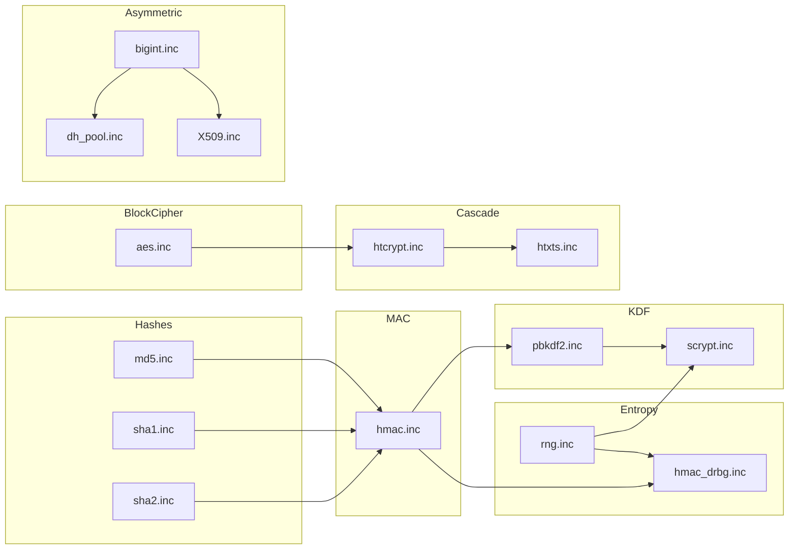

# HeavyThing Cryptography

The cryptography subsystem provides in-process, zero-dependency implementations of
the block cipher, hash, MAC, key-derivation, random-number, big-integer, and
certificate-parsing primitives that the rest of the library (TLS, SSH, `toplip`,
`dhtool`) builds on.

## Overview

The subsystem is a self-contained set of `.inc` files at the repository root that
together provide AES-128/192/256, SHA-1, SHA-2, MD5, HMAC, HMAC-DRBG, PBKDF2,
scrypt, a combined SFMT + Mother-of-all PRNG, big-integer arithmetic, X.509 / SSH
key parsing, and cascaded symmetric encryption (`htcrypt` / `htxts`). No libc and
no external crypto library is linked; every primitive is authored in x86_64
assembly (Source: `/aes.inc:22-38`, `/sha2.inc:22-30`, `/rng.inc:22-45`).

These primitives are consumed directly by the networking subsystem (`tls.inc`,
`ssh.inc`), by the `toplip` file-encryption tool, by the `dhtool` Diffie-Hellman
parameter utility, and by any application that includes `ht.inc` with the relevant
crypto labels referenced (Source: `/ht.inc:141-164`).

## Architecture Fit

Incoming dependencies (what crypto builds on):

| Dependency | Role | Source |
|---|---|---|
| `../heap.inc` | `heap$alloc` / `heap$free` back every `*$new` / `*$destroy` pair in this subsystem. | `/ht.inc:90` |
| `../memfuncs.inc` | Bulk copies and state-clearing for primitive objects. | `/ht.inc:92` |
| `../rng.inc` | Feeds key material, IVs, nonces, and DH private exponents. | `/ht.inc:103` |
| `../bigint.inc` | Variable-precision integer arithmetic underneath Diffie-Hellman and X.509. | `/ht.inc:162` |

Outgoing dependencies (what consumes crypto):

| Consumer | Primitives Consumed | Source |
|---|---|---|
| `../tls.inc` | `aes`, `sha1`, `sha2`, `md5`, `hmac`, `hmac_drbg`, `X509`, `bigint`, `dh_pool*` | `/ht.inc:166` |
| `../ssh.inc` | `aes`, `sha2`, `hmac`, `X509`, `bigint`, `dh_pool*` | `/ht.inc:167` |
| `../toplip/toplip.asm` | `aes`, `htcrypt`, `htxts`, `scrypt`, `rng`, `sha2`, `pbkdf2` | — |
| `../dhtool/dhtool.asm` | `bigint`, `dh_pool*`, `rng`, `X509` | — |

Within `ht.inc`, crypto files are included after the heap / list / map / buffer
core and before the networking layer. The exact load order is `crc.inc` (line 97)
-> `rng.inc` (line 103) -> `sha2.inc` / `sha1.inc` / `md5.inc` / `hmac.inc` /
`hmac_drbg.inc` / `pbkdf2.inc` / `scrypt.inc` (lines 141-147) -> `aes.inc`
(line 149) -> `htcrypt.inc` / `htxts.inc` (lines 150-151) -> `bigint.inc` /
`dh_pool.inc` / `X509.inc` (lines 162-164), after which `tls.inc` and `ssh.inc`
become callable (Source: `/ht.inc:97-167`). The three-file include contract
(`ht_defaults.inc` -> `ht.inc` -> `ht_data.inc`) that makes this ordering work
is documented authoritatively in [`../docs/architecture.md`](../docs/architecture.md).



## Key Components

| File | Purpose |
|---|---|
| [`../aes.inc`](../aes.inc) | AES-128 / AES-192 / AES-256 block cipher with AES-NI fast path and a Wei Dai SSE2 software fallback that includes documented timing countermeasures (Source: `/aes.inc:22-38`). |
| [`../sha1.inc`](../sha1.inc) | SHA-1 (160-bit) hash exposed as `sha160$*`; retained for TLS 1.0 / 1.1 interoperability (Source: `/sha1.inc:22`). |
| [`../sha2.inc`](../sha2.inc) | SHA-224 / SHA-256 / SHA-384 / SHA-512 hashes, translated from Wei Dai public-domain code (Source: `/sha2.inc:22-30`). |
| [`../md5.inc`](../md5.inc) | MD5 hash built on Marc Bevand's public-domain core; retained for TLS 1.0 / 1.1 interoperability only (Source: `/md5.inc:22-28`). |
| [`../hmac.inc`](../hmac.inc) | HMAC construction over MD5 / SHA-1 / SHA-224 / SHA-256 / SHA-384 / SHA-512 per RFC 2104; includes the TLS PRF expansion helper `hmac$phash` (Source: `/hmac.inc:22-30`). |
| [`../hmac_drbg.inc`](../hmac_drbg.inc) | HMAC-DRBG deterministic random-bit generator (NIST SP 800-90A) that reseeds from `/dev/urandom` after `1 shl 19` calls to `hmac_drbg$generate` (Source: `/hmac_drbg.inc:21-45`). |
| [`../pbkdf2.inc`](../pbkdf2.inc) | PBKDF2 password-based key derivation (RFC 2898); every `pbkdf2$new_*` variant wraps the matching `hmac$new_*` (Source: `/pbkdf2.inc:22-26`). |
| [`../scrypt.inc`](../scrypt.inc) | scrypt memory-hard KDF (Colin Percival, RFC 7914); the top-level labels are `scrypt` and `scrypt_iter` rather than `scrypt$*` (Source: `/scrypt.inc:22-60`). |
| [`../rng.inc`](../rng.inc) | Combined SFMT + Mother-of-all PRNG transcoded from Agner Fog's library; the heavy-init path seeds 64 bytes from `rdtsc` + `gettimeofday` + `/dev/urandom` (Source: `/rng.inc:22-45`). |
| [`../htcrypt.inc`](../htcrypt.inc) | Cascaded 256-context AES-256 symmetric encryption with a scrypt-modified HMAC-SHA-512 key schedule (Source: `/htcrypt.inc:22-46`). |
| [`../htxts.inc`](../htxts.inc) | AES-XTS block-level encryption wrapper over `htcrypt` for random-access workloads; default block size 2048 bytes (Source: `/htxts.inc:22-30`). |
| [`../bigint.inc`](../bigint.inc) | Variable-precision integer arithmetic; foundation for Diffie-Hellman and X.509 RSA / DSA (Source: `/bigint.inc:22-28`). |
| [`../X509.inc`](../X509.inc) | Minimal X.509 / PEM parser and `/etc/ssh/ssh_host_rsa_key` reader; exposes `X509$new_pem` and `X509$new_ssh` (Source: `/X509.inc:22-40`). |
| [`../dh_groups.inc`](../dh_groups.inc) | Generator (`g`) values for the `dh_pool*` prime groups (Source: `/dh_groups.inc:22-24`). |
| [`../dh_pool.inc`](../dh_pool.inc) + `dh_pool_{2k,3k,4k,6k,8k,16k}.inc` | Static Diffie-Hellman safe-prime / generator pools at the listed bit widths, chosen at random by TLS and SSH group exchange (Source: `/dh_pool.inc:22-32`). |

## Calling Convention

All labels follow the System V AMD64 argument convention (`rdi`, `rsi`, `rdx`,
`rcx`, `r8`, `r9`) with the library-wide register, stack-alignment, and `prolog`
/ `epilog` rules documented in
[`../docs/calling-convention.md`](../docs/calling-convention.md). The subsystem-
specific entry labels follow the `subsystem$function` pattern library-wide
(Source: `/ht.inc:316-626`), with one exception: `scrypt` and `scrypt_iter` are
top-level labels rather than `scrypt$*` (Source: `/scrypt.inc:63-90`,
`/scrypt.inc:440-470`).

| Label | Inputs | Output / Effect | Source |
|---|---|---|---|
| `sha256$new` | (none) | `rax` = newly heap-allocated, initialised SHA-256 state object | `/sha2.inc:108` |
| `sha256$init` | `rdi` = state | re-initialised in place | `/sha2.inc:125` |
| `sha256$update` | `rdi` = state, `rsi` = bytes, `rdx` = length | state advanced | `/sha2.inc:166` |
| `sha256$final` | `rdi` = state, `rsi` = 32-byte output, `edx` = 1 to free / 0 to keep | digest written; state freed or re-initialised | `/sha2.inc:910` |
| `sha512$new` / `$init` / `$update` / `$final` | analogous, 64-byte output | — | `/sha2.inc:1253`, `:1270`, `:1310`, `:1934` |
| `sha160$new` / `$init` / `$update` / `$final` | analogous, 20-byte output | — | `/sha1.inc:36`, `:52`, `:90`, `:491` |
| `md5$new` / `$init` / `$update` / `$final` | analogous, 16-byte output | — | `/md5.inc:32`, `:48`, `:87`, `:371` |
| `hmac$new_sha256` (and `_md5`, `_sha1`, `_sha224`, `_sha384`, `_sha512`) | (none) | `rax` = new HMAC object bound to the chosen hash | `/hmac.inc:138` |
| `hmac$key` | `rdi` = HMAC, `rsi` = key bytes, `edx` = key length | keyed in place - CALL ONCE; use `hmac$replace_key` to re-key | `/hmac.inc:255`, `:350` |
| `hmac$data` | `rdi` = HMAC, `rsi` = data, `rdx` = length | state advanced | `/hmac.inc:367` |
| `hmac$final` | `rdi` = HMAC, `rsi` = destination buffer | digest written | `/hmac.inc:602` |
| `hmac$phash` | `rdi` = HMAC, `rsi` = output, `edx` = desired length, `rcx` = seed bytes, `r8d` = seed length | TLS PRF-style expansion | `/hmac.inc:382` |
| `aes$init_encrypt` | `rdi` = AES object (forced-aligned to 16), `rsi` = key ptr, `edx` = key length (16 / 24 / 32) | Entry point forces 16-byte alignment and calls `aes$init_common`, which dispatches to AES-NI or Wei Dai SSE2 via `has_AESNI`; object size is `aes_size = 264` | `/aes.inc:615` (`aes$init_encrypt`), `/aes.inc:251` (`aes$init_common` dispatcher) |
| `aes$init_decrypt` | same argument shape as `aes$init_encrypt` | initialised for decryption | `/aes.inc:681` |
| `aes$encrypt` | `rdi` = AES object, `rsi` = 16-byte block pointer | block encrypted in place | `/aes.inc:977` |
| `aes$decrypt` | `rdi` = AES object, `rsi` = 16-byte block pointer | block decrypted in place | `/aes.inc:1202` |
| `pbkdf2$doit` | `rdi` = PBKDF2 object, `rsi` = destination, `edx` = length, `rcx` = salt, `r8d` = salt length, `r9d` = iteration count | derived key material written | `/pbkdf2.inc:219` |
| `scrypt` | `rdi` = destination, `esi` = length, `rdx` = passphrase, `ecx` = passphrase length, `r8` = salt, `r9d` = salt length | derived key material written (N, r, p from `ht_defaults.inc`) | `/scrypt.inc:68` |
| `scrypt_iter` | six `scrypt` args plus `r10d` = inner PBKDF2 iteration count | derived key material written | `/scrypt.inc:446` |
| `hmac_drbg$new` | `rdi` = one of `hmac$init_*`, `rsi` = seed material, `edx` = seed length | `rax` = new DRBG object | `/hmac_drbg.inc:50` |
| `hmac_drbg$generate` | `rdi` = DRBG, `rsi` = destination, `edx` = desired length in BYTES | random bytes written | `/hmac_drbg.inc:150` |
| `rng$u32` | (none) | `eax` = 32 random bits | `/rng.inc:631` |
| `rng$u64` | (none) | `rax` = 64 random bits | `/rng.inc:721` |
| `rng$block` | `rdi` = buffer, `rsi` = length | buffer filled | `/rng.inc:934` |
| `rng$init` | (none; called automatically from `ht$init`) | PRNG state seeded | `/rng.inc:133` (heavy) or `/rng.inc:381` (light) |

Alignment notes. The AES object is forced to 16-byte alignment by
`aes$init_encrypt` / `aes$init_decrypt` on entry (`add rdi, 0xf` / `and rdi, not
0xf`) and `aes$init_common` dispatches to AES-NI or Wei Dai SSE2 based on the
boot-time `has_AESNI` flag; the object layout (`aes_size = 264`) is identical in
either path (Source: `/aes.inc:251-260`, `/aes.inc:615-650`). SHA state objects
force all three internal pointer fields (`sha_stateptr_ofs`,
`sha_bitcountptr_ofs`, `sha_bufferptr_ofs`) to 16-byte alignment at `init` time
(Source: `/sha2.inc:41-46`). HMAC does not perform its own alignment-selection
test; instead it holds a function-pointer table (`hmac_macinit_ofs`,
`hmac_macupdate_ofs`, `hmac_macfinal_ofs`, `hmac_macsize_ofs`) at the start of
its state object and delegates every hash call to the underlying SHA or MD5
implementation, which handles its own alignment (Source: `/hmac.inc:22-32`).

## Usage

The minimum viable SHA-256 caller follows the three-file include contract
(`ht_defaults.inc` -> `ht.inc` -> `ht_data.inc` - see
[`../docs/architecture.md`](../docs/architecture.md)) and calls `ht$init` before
any crypto primitive, so that `rng$init` and CPU-feature detection run first
(Source: `/ht.inc:613-626`, `/examples/sha256/sha256.asm:25-98`).

```nasm
; minimal SHA-256 of an in-memory buffer
include 'ht_defaults.inc'
include 'ht.inc'

public _start
_start:
    call    ht$init                 ; library init; also seeds rng, detects AES-NI
    call    sha256$new              ; rax = new SHA-256 state object
    mov     r12, rax
    mov     rdi, rax                ; rdi = state
    mov     rsi, message            ; rsi = input bytes
    mov     rdx, message_len        ; rdx = length
    call    sha256$update
    sub     rsp, 32                 ; reserve 32 bytes for the digest
    mov     rdi, r12
    mov     rsi, rsp
    mov     edx, 1                  ; edx = 1 -> free state after final
    call    sha256$final
    ; 32-byte digest now lives at [rsp]
    mov     eax, syscall_exit
    xor     edi, edi
    syscall

include 'ht_data.inc'
```

The full runnable program - including argv handling, `privmapped$new` for mapping
an input file, and hex output via `string$from_bintohex` + `string$to_stdoutln` -
lives at
[`../examples/sha256/sha256.asm`](../examples/sha256/sha256.asm) (Source:
`/examples/sha256/sha256.asm:25-98`). Build with
`fasm -m 524288 source.asm && ld -o binary source.o`; the complete build flow is
documented in [`../docs/building.md`](../docs/building.md).

## Configuration

Every crypto setting is compile-time fixed in `ht_defaults.inc`; there is no
runtime algorithm registry or plugin model.

| Knob | Default | Effect | Source |
|---|---|---|---|
| `rng_heavy_init` | `1` | When `1`, `rng$init` seeds 64 bytes from `rdtsc` + `gettimeofday` + `/dev/urandom` (or `/dev/random` when `rng_paranoid = 1`). When `0`, uses a lightweight `rdtsc`-cascade seed only. | `/ht_defaults.inc:94` |
| `rng_paranoid` | `0` | When `1`, the heavy-init path reads from `/dev/random` instead of `/dev/urandom`; may block on a freshly-booted system. | `/ht_defaults.inc:98` |
| `bigint_maxwords` | `512` | Maximum number of 64-bit limbs per `bigint`; bounds the maximum achievable DH / RSA key size. | `/ht_defaults.inc:262` |
| `dh_bits` | `2048` | Default Diffie-Hellman group size used by TLS and SSH. A commented alternative at line 280 selects `4096`. | `/ht_defaults.inc:281` |
| `dh_privatekey_size` | `256` | DH private-exponent size in bits. A commented alternative at line 292 selects `512`. | `/ht_defaults.inc:293` |
| `scrypt_sha512` | `1` | When `1`, the PBKDF2 inner hash used by `scrypt` is SHA-512 (faster on 64-bit CPUs). When `0`, SHA-256 is used. | `/ht_defaults.inc:386` |
| `scrypt_N` | `1024` | scrypt cost parameter `N` (iteration / memory scaling factor, must be a power of two). | `/ht_defaults.inc:387` |
| `scrypt_r` | `1` | scrypt block-size parameter `r`. | `/ht_defaults.inc:388` |
| `scrypt_p` | `1` | scrypt parallelisation parameter `p`. | `/ht_defaults.inc:389` |

## Limitations

- No formal constant-time guarantees are published for these primitives. AES
  inherits Wei Dai's documented timing countermeasures when the AES-NI fast path
  is unavailable, but the remainder of the subsystem has not been audited for
  side-channel resistance (Source: `/aes.inc:22-38`). Defer full posture to
  [`../docs/security.md`](../docs/security.md).
- MD5 and SHA-1 are collision-broken and retained purely for TLS 1.0 / 1.1
  interoperability; they should not be used in new designs (Source:
  `/md5.inc:22`, `/sha1.inc:22`).
- TLS 1.3 is not implemented; the networking subsystem supports TLS 1.2 only (no
  `tls_1_3.inc` is present in the repository).
- Elliptic-curve primitives (Ed25519, X25519, P-256 / P-384, ECDSA, ECDH) are
  not implemented; Diffie-Hellman is finite-field only via `bigint.inc` and the
  `dh_pool*` safe-prime pools.
- ChaCha20-Poly1305 and other integrated AEAD ciphers are not implemented;
  symmetric encryption is AES-only and authentication is performed via an
  explicit HMAC pass over the ciphertext.
- Argon2 is not implemented; `scrypt` is the memory-hard ceiling of the KDF set.
- `X509.inc` parses and builds certificates and extracts OCSP stapling data but
  does not perform full PKIX chain validation; callers that require verified
  trust must implement it on top (Source: `/X509.inc:58`, `/X509.inc:209`).
- `rng.inc` alone (SFMT + Mother-of-all) is not suitable as a source of
  cryptographic keying material. Use `hmac_drbg` seeded from `rng$block` or
  `/dev/urandom` for every cryptographic key, IV, or nonce (Source:
  `/rng.inc:22-45`, `/hmac_drbg.inc:22-50`).
- `hmac$key` is call-once: calling it twice against the same object without an
  intervening `hmac$replace_key` corrupts the inner / outer key padding state
  (Source: `/hmac.inc:248-255`, `/hmac.inc:350`).

Full cryptographic posture, cipher-suite tables, and SSH / TLS support matrices
live in [`../docs/security.md`](../docs/security.md).

## See Also

- Project overview: [`../README.md`](../README.md)
- Library architecture and include graph: [`../docs/architecture.md`](../docs/architecture.md)
- Library-wide register, stack, and label conventions: [`../docs/calling-convention.md`](../docs/calling-convention.md)
- Security posture, cipher-suite matrix, operational guidance: [`../docs/security.md`](../docs/security.md)
- Build instructions: [`../docs/building.md`](../docs/building.md)
- Contributor guide (how to add a new crypto module): [`../docs/contributing.md`](../docs/contributing.md)
- Networking subsystem (consumes crypto for TLS and SSH): [`../net/README.md`](../net/README.md)
- `toplip` file-encryption tool: [`../toplip/README.md`](../toplip/README.md)
- `dhtool` Diffie-Hellman parameter utility: [`../dhtool/README.md`](../dhtool/README.md)
- SHA-256 worked example: [`../examples/sha256/sha256.asm`](../examples/sha256/sha256.asm)

---

Licensed under GPLv3. See [`../LICENSE`](../LICENSE).

