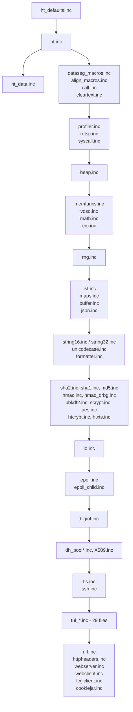
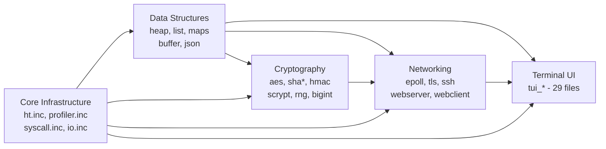
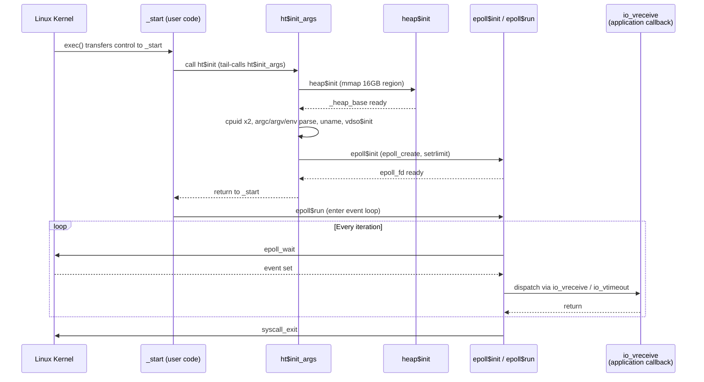

# HeavyThing Architecture

## Overview

HeavyThing is a layered event-driven monolithic library written in x86_64 FASM
assembly. Every HeavyThing application is assembled as a single statically linked
ELF64 binary via a mandatory three-file include contract, with no libc dependency
and no shared libraries at runtime. At assembly time the library fans out from
`ht.inc` into more than one hundred submodules pulled in via a deterministic include
chain (Source: /ht.inc:51-208). The architecture is organised around four conceptual
subsystems — Data Structures, Cryptography, Networking, and Terminal UI — built on
top of a Core Infrastructure layer that provides macros, allocators, profiling,
and the IO chaining model.

## The Three-File Include Contract

Every HeavyThing program must include exactly three files in this exact order.
This ordering is enforced by FASM's single-pass section emission model and is the
single most important invariant for a working build.

1. **`ht_defaults.inc`** — included **first**. Sets `format ELF64` (Source:
   /ht_defaults.inc:24-26) and establishes every compile-time knob that the rest
   of the library reads at assembly time (alignment, profiling, heap sizing, epoll
   limits, TLS parameters, SSH parameters, web server defaults, crypto tuning, RNG
   initialisation mode). Without this file appearing first the FASM `format`
   directive is missing and assembly fails.

2. **`ht.inc`** — included **second**. Declares
   `section '.text' executable align 16` (Source: /ht.inc:57) and records the
   start of the executable segment in `ht$codeseg` (Source: /ht.inc:58). From
   this point on, every subsequent `include` transitively pulls library code into
   `.text`. The full transitive chain is at /ht.inc:51-208.

3. **`ht_data.inc`** — included **last**. Declares
   `section '.data' writeable align 16` (Source: /ht_data.inc:34) and records
   `ht$dataseg = $` (Source: /ht_data.inc:32) as the base address of the data
   segment. Closing the contract at the end of the source file ensures every
   `globals { }` block declared by any earlier-included module has already been
   seen, so FASM can emit the accumulated data definitions into `.data` rather
   than into the middle of `.text`.

The canonical application skeleton is reproduced below from the simplest worked
example (Source: /examples/hello_world/hello_world.asm:24-41):

```nasm
include '../../ht_defaults.inc'          ; first
include '../../ht.inc'                   ; second

public _start
_start:
        ; every HeavyThing program needs to start with a call to initialise it
        call    ht$init

        mov     rdi, .helloworld
        call    string$to_stdoutln
        mov     eax, syscall_exit
        xor     edi, edi
        syscall

cleartext .helloworld, 'Hello World'

include '../../ht_data.inc'              ; last
```

### Include Dependency Graph

The summary graph below reflects the actual include order in /ht.inc:51-208.
The TUI set collapses 29 `tui_*.inc` files into a single node; the Diffie-Hellman
pool set collapses the per-size `dh_pool*.inc` files into a single node. Arrows
follow the assembly-time order in which each group first appears inside `ht.inc`.



The edge from `ht.inc` to `ht_data.inc` is dotted in intent: application `.asm`
files include `ht_data.inc` directly as their final include, rather than `ht.inc`
transitively including it. The graph shows the logical closing of the contract.

## Subsystem Boundaries

The library partitions into five conceptual subsystems. Core Infrastructure is
documented in the root README; the other four subsystems each carry a dedicated
README cross-linked from `## See Also`.

| Subsystem | Constituent Files | Documentation |
|---|---|---|
| Core Infrastructure | `ht.inc`, `ht_defaults.inc`, `ht_data.inc`, `align_macros.inc`, `call.inc`, `cleartext.inc`, `dataseg_macros.inc`, `syscall.inc`, `profiler.inc`, `rdtsc.inc`, `breakpoint.inc`, `sleeps.inc`, `vdso.inc`, `crc.inc`, `math.inc`, `memfuncs.inc`, `date.inc`, `dir.inc`, `file.inc`, `formatter.inc`, `io.inc`, `png.inc`, `string16.inc`, `string32.inc`, `string_math.inc`, `sysinfo.inc`, `syslog.inc`, `unicodecase.inc`, `zlib_deflate.inc`, `zlib_inflate.inc` | `/README.md` |
| Data Structures | `list.inc`, `maps.inc`, `heap.inc`, `buffer.inc`, `json.inc`, `mapped.inc`, `privmapped.inc`, `mappedheap.inc` | `/ds/README.md` |
| Cryptography | `aes.inc`, `sha1.inc`, `sha2.inc`, `md5.inc`, `hmac.inc`, `hmac_drbg.inc`, `pbkdf2.inc`, `scrypt.inc`, `htcrypt.inc`, `htxts.inc`, `rng.inc`, `bigint.inc`, `X509.inc`, `dh_groups.inc`, `dh_pool*.inc`, `base64_latin1.inc`, `blacklist.inc` | `/crypto/README.md` |
| Networking | `epoll.inc`, `epoll_child.inc`, `epoll_dns.inc`, `http1.inc`, `httpheaders.inc`, `tls.inc`, `ssh.inc`, `webclient.inc`, `webserver.inc`, `fcgiclient.inc`, `cookiejar.inc`, `url.inc`, `mimelike.inc` | `/net/README.md` |
| Terminal UI | 29 `tui_*.inc` files | `/tui/README.md` |

### Subsystem Boundary Map

Edges on the map below show dependencies derived from the include order: `heap.inc`
at /ht.inc:90 precedes every higher layer; cryptography is pulled in after data
structures and before the network stack; TUI is included after networking because
some widgets (e.g. `tui_ssh.inc`) sit on top of the networking layer (Source:
/ht.inc:159-201).



## Initialisation and Event-Loop Lifecycle

`ht$init` is the canonical entry point that every program must call as its first
instruction after `_start`. Source: /ht.inc:608-628.

- `ht$init` is a thin wrapper: it extracts `argc` and `argv` from their positions
  on the process stack (the layout differs depending on whether `framepointers`
  was enabled at assembly time), places them into `edi` and `rsi` respectively,
  then falls through to `ht$init_args` (Source: /ht.inc:607-628).

- `ht$init_args` performs the main initialisation with `edi == argc` and
  `rsi == argv` at entry (Source: /ht.inc:316-326). The body runs every major
  initialisation step conditionally, guarded by FASM `if used` predicates so that
  unused subsystems leave no code in the binary:
  - `if code_preload = 1` — walks the code segment once with `movapd` to prefault
    every page into the TLB before serving requests (Source: /ht.inc:322-331).
  - `profiler$init` is called when `profiling = 1` to allocate the profiler
    record stack.
  - `heap$init` runs unconditionally before any other major initialiser, because
    every downstream module assumes the heap is ready.
  - Two `cpuid` calls extract the vendor string, feature bits, and cache-line
    size into globals.
  - `argc`, `argv`, and the environment vector are parsed and materialised into
    a `list$new` list and a `stringmap$new` map, but only when the corresponding
    globals are referenced elsewhere (Source: /ht.inc:210-302 documents the
    `if used` guard pattern).
  - `uname` is issued via `SYS_uname` and the returned fields land in globals
    (`_sysname`, `_nodename`, `_release`, `_version`, `_machine`).
  - `vdso$init` is always called and probes the Linux vDSO to accelerate
    `gettimeofday`-class syscalls.
  - Remaining initialisers (`syslog$init`, `rng$init`, `epoll$init`,
    `tls$peminit`, `tls$sessioncacheinit`, `ssh$blacklist = blacklist$new(...)`,
    `tui_splash$initlogo`, `tui_statusbar$globalinit`, `url$init`,
    `webserver$init`, `webservercfg$init`, `fcgiclient$init`, `wcdns$init`) are
    each guarded by `if used` and only run when their respective label is
    referenced anywhere in the binary (Source: /ht.inc:563-604).

- Once `ht$init` returns, control is back in the user's `_start`. A trivial
  program exits immediately via `syscall_exit` (value `60`, Source:
  /syscall.inc:89). A long-running program calls an event-loop driver such as
  `epoll$run`, which invokes `epoll_wait` in a loop, dispatches each returned
  event through the appropriate `io_v*` virtual method, services AVL-tree timers
  between iterations, and exits when all IO descriptors are closed.

- Teardown is minimal. Most programs exit via `syscall_exit` directly without
  dismantling the heap. The 16 GB (or fallback smaller) heap region obtained by
  `heap$init` is never returned to the kernel (Source: /heap.inc) — the
  operating system reclaims the entire address space when the process terminates.
  This is a deliberate design choice: HeavyThing targets long-lived servers that
  converge to a steady-state working set, so trading `munmap` traffic for a
  single tear-down at exit simplifies the allocator hot path.

### Lifecycle Sequence Diagram



## IO Chaining Model

HeavyThing implements a layered IO design in which TLS, SSH, and application
protocols wrap a raw epoll socket through a linked chain of IO descendants. The
chain is the single mechanism by which the networking stack is composed.

The base object `io$` is **24 bytes** and is laid out as follows (Source:
/io.inc:31-35):

- offset `+0`: `io_vmethods_ofs` — pointer to a virtual method table
- offset `+8`: `io_parent_ofs` — pointer to the IO object immediately above
  this one in the chain (or null at the top)
- offset `+16`: `io_child_ofs` — pointer to the IO object immediately below
  this one in the chain (or null at the bottom)

The virtual method table contains seven entries and occupies 56 bytes (Source:
/io.inc:38-52):

| Offset | Method | Propagation |
|---|---|---|
| 0 | `io_vdestroy` | forward through child chain |
| 8 | `io_vclone` | forward |
| 16 | `io_vconnected` | backward toward parent |
| 24 | `io_vsend` | forward |
| 32 | `io_vreceive` | backward |
| 40 | `io_verror` | backward |
| 48 | `io_vtimeout` | backward |

The propagation rule is stated explicitly in the source: `destroy`, `clone`, and
`send` walk FORWARD through the child chain; `receive`, `connected`, `error`, and
`timeout` walk BACKWARD toward the parent (Source: /io.inc:26-27).

**Chain composition.** An application constructs a chain top-down: the
application-layer object is the root (its parent pointer is null) and the
`epoll$` object is the tail (its child pointer is null). Because the chain is
doubly linked, entry points such as `epoll$outbound`, `epoll$established`, and
`epoll$send` can be invoked on any link in the chain and will walk to the real
epoll object transparently (Source: /epoll.inc:30-43).

**Concrete HTTPS example.** An outbound HTTPS request is composed as three
links: `webclient` (root) → `tls` (middle) → `epoll` (tail). A byte arriving at
the socket triggers `io_vreceive` at the epoll layer and walks backward: `epoll`
buffers the raw bytes, `tls` decrypts, `webclient` parses the resulting HTTP.
A `send` call made on the `webclient` object walks forward: `webclient` emits
the HTTP request, `tls` encrypts the request into a record, `epoll` writes the
record to the socket.

**Descendants.** The `epoll$` object extends `io$` by 80 bytes, for a total of
104 bytes (Source: /epoll.inc structure definition). `tls$` descends directly
from `io$` rather than from `epoll$`, because TLS is a layer above epoll rather
than a variant of it (Source: /tls.inc). `ssh$` descends similarly (Source:
/ssh.inc). All 29 `tui_*` widgets descend from `tui_object`, which is laid out
to mimic the `io$` layout so that the same timer and event-dispatch code can
service widgets and sockets uniformly.

**Input buffering.** The default `epoll$receive` accumulates bytes into an
append-only per-object buffer; upstream links consume the buffer and are
responsible for resetting it on message boundaries (Source: /epoll.inc:71-81).

**Output back-pressure.** The epoll layer does not poll `EPOLLOUT`
continuously. Instead, a write-ready callback is armed only after a partial
write or an `EAGAIN`/`EWOULDBLOCK` return. An upstream link registers a single
callback that is invoked twice: once when the outbound buffer first has queued
data, and once when the buffer has drained and additional data may be sent
(Source: /epoll.inc:84-102).

## Heap Allocator

`heap.inc` implements a bin-based allocator that never returns memory to the
kernel. At `heap$init` time it attempts a 16 GB `mmap` (2 GB base shifted left
three times) and falls back progressively through 2 GB, 1 GB, 512 MB, and
256 MB before aborting with exit code 99 (Source: /heap.inc:87-216). The `mmap`
flags are `PROT_READ | PROT_WRITE` (`0x3`) and `MAP_PRIVATE | MAP_ANONYMOUS`
(`0x22`) (Source: /heap.inc:88-89). The globals `_heap_base` and
`_heap_base_size` record the obtained region.

The bin layout accommodates four tiers of fixed-granularity bins and a direct
`mmap` path for large allocations (Source: /heap.inc:56-61):

| Range (bytes) | Bin Granularity | Bin Count |
|---|---|---|
| 0 – 2048 | 64 | 32 |
| 2048 – 16384 | 1024 | 14 |
| 16384 – 131072 | 4096 | 28 |
| 131072 – 1048576 | 65536 | 14 |
| > 1048576 (1 MB) | direct `mmap` per allocation | — |

The in-heap header occupies `139272 + (heap_bincheck * 8)` bytes (Source:
/heap.inc:63). The never-return-to-kernel strategy is deliberate: HeavyThing
targets long-running server processes whose resident-set size converges to a
steady state after warm-up. The allocator minimises `mmap`/`munmap` syscall
traffic on the hot path, at the cost of appearing to leak memory from an
operator's perspective. Monotonic growth of RSS is expected until the working
set stabilises.

## Exit Codes

The library emits four distinct non-zero exit codes at initialisation time.
These are the only process exit codes produced by the library itself; any other
non-zero exit originates from application code. Source: /ht.inc:38-42.

| Exit Code | Trigger |
|---|---|
| 0 | Normal exit (caller-issued `syscall_exit` with `rdi = 0`) |
| 96 | `epoll_create` syscall failed during `epoll$init` |
| 97 | Epoll minimum file-descriptor count (`epoll_minfds`) could not be satisfied by `setrlimit` |
| 98 | Profiler record stack overrun (`profiler_recordcount` exceeded) |
| 99 | Heap `mmap` or `mremap` failed — system is out of memory, or `RLIMIT_AS` is too low to cover the smallest fallback size |

## See Also

- `./building.md` — FASM invocation, linking, and the build flow
- `./calling-convention.md` — register contract, label naming, `prolog`/`epilog` macros
- `./security.md` — crypto primitive scope, TLS and SSH support matrices
- `./contributing.md` — adding a new `.inc` module, the `if used` / `include_everything` pattern
- `../ds/README.md` — data structures subsystem
- `../crypto/README.md` — cryptography subsystem
- `../net/README.md` — networking subsystem
- `../tui/README.md` — terminal UI subsystem
- `../ht.inc` — master include file (lines 51-208 for the include chain; lines 314-628 for `ht$init_args` and `ht$init`)
- `../ht_defaults.inc` — compile-time configuration knobs
- `../LICENSE` — GPLv3 license text
