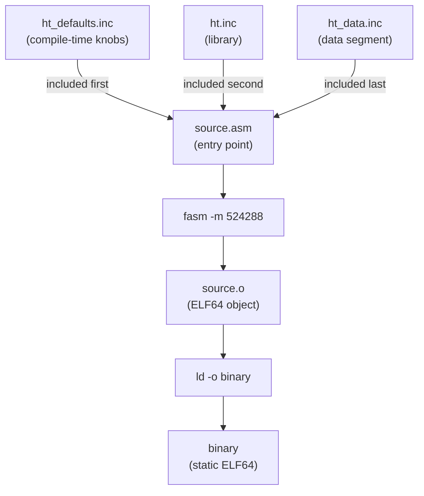

# Building HeavyThing Applications

## Overview

HeavyThing is written for **FASM (Flat Assembler)** by Tomasz Grysztar, not NASM. The first line of compiled output is established by the `format ELF64` directive in `/ht_defaults.inc:26`, accompanied by the explicit comment "we are the first include, set our fasm format" (Source: /ht_defaults.inc:24-26). Every `.asm` entry point and every `.inc` module in the repository is pure FASM syntax. The build process is intentionally minimal — two commands, `fasm` to produce an ELF64 object followed by `ld` to produce a static binary. No Makefile, autotools configuration, package manifest, or CI workflow is present in the repository.

Every public label in HeavyThing uses the form `subsystem$function`. The dollar sign is a legal identifier character in FASM and serves as the namespace separator. This is one of the reasons the library is authored in FASM rather than NASM: NASM treats `$` as the current-address expression operator and would not accept it as part of an identifier. The full label-naming convention is documented in `/docs/calling-convention.md`.

Three properties follow from this minimalism. First, a HeavyThing binary has no shared-library dependencies at runtime because the library does not link against libc (Source: /ht.inc:22-42). Second, the build is reproducible from an unmodified checkout without any package-manager prerequisites beyond FASM itself and GNU `ld`. Third, compile-time configuration is handled entirely through integer and symbol assignments in `/ht_defaults.inc`, not through build-system flags — every knob that affects the emitted binary is a source-level constant.

A display-syntax note: the Markdown code fences throughout HeavyThing documentation use the `nasm` language tag because GitHub's syntax highlighter does not offer a `fasm` option, and `nasm` provides the closest Intel-syntax rendering. The assembler invoked by every build command shown below is FASM. Syntactic differences between FASM and NASM — for example, FASM's `format ELF64` directive versus NASM's command-line `-f elf64` flag — are significant and are not interchangeable.



## Prerequisites

| Requirement | Notes |
|---|---|
| FASM (Flat Assembler) by Tomasz Grysztar | Version 1.73 or compatible, available at `https://flatassembler.net/`. Invoked as `fasm`. Not NASM. The FASM dependency is fixed by the `format ELF64` directive and accompanying comment in `/ht_defaults.inc:24-26`. |
| Linux x86_64 | The target platform. HeavyThing uses direct Linux syscalls rather than libc wrappers (Source: /syscall.inc) and is not portable to other operating systems or CPU architectures. |
| GNU `ld` (binutils) | The standard linker present on every Linux distribution. Used to convert the FASM `.o` output into a statically linked ELF64 executable. |
| GCC or G++ (optional) | Required only for the mixed-language examples under `/examples/hello_world_c1/`, `/examples/hello_world_c2/`, `/examples/simplechat_c++/`, `/examples/simplechat_ssh_c++/`, and `/examples/simplechat_ssh_auth_c++/`. Not required for pure-assembly HeavyThing programs. |
| No libc | HeavyThing does not link against libc. Binaries are statically linked ELF64 executables with no shared-library dependencies. The zero-libc posture is established in the header comment block of `/ht.inc:22-42`. |

## Minimum Viable Build

The canonical minimal build target is `/examples/hello_world/hello_world.asm` (Source: /examples/hello_world/hello_world.asm:1-42), a 42-line program that initialises the library, prints a single line, and exits cleanly. Its full body is shown below.

```nasm
; hello_world.asm -- canonical three-file include contract
;
; first things first, include the library defaults, and the
; library main include:
include '../../ht_defaults.inc'
include '../../ht.inc'

public _start
_start:
    ; every HeavyThing program needs to start with a call to initialise it
    call    ht$init

    mov     rdi, .helloworld
    call    string$to_stdoutln
    mov     eax, syscall_exit
    xor     edi, edi
    syscall

cleartext .helloworld, 'Hello World'

    ; include the global data segment:
include '../../ht_data.inc'
```

The build sequence, executed from the repository root, is two commands:

```bash
cd examples/hello_world
fasm -m 524288 hello_world.asm    # produces hello_world.o
ld -o hello_world hello_world.o   # produces the ELF64 static binary
./hello_world                     # prints: Hello World
```

The `-m 524288` flag raises FASM's internal symbol-pool memory limit to 524288 KB (512 MB). HeavyThing's fully transitive include graph contains enough symbols to exceed FASM's default pool; the `-m 524288` flag is therefore required for any non-trivial program that transitively includes `/ht.inc`. Without it, FASM aborts with an out-of-memory error during symbol-table construction.

The `ld -o binary object.o` invocation links the single object file produced by FASM into a static ELF64 executable. No dynamic linking occurs, no shared libraries are pulled in, and no libc is referenced. The resulting binary has no runtime dependencies beyond the Linux kernel's syscall interface.

The `call ht$init` at the top of every entry point is the only mandatory runtime step (Source: /examples/hello_world/hello_world.asm:29-30). Internally, `ht$init` extracts `argc` and `argv` from the stack frame (Source: /ht.inc:607-626) and dispatches to `ht$init_args`, which in turn performs CPU-feature detection, heap bring-up, RNG seeding, epoll initialisation, TLS state, SSH state, and every other subsystem whose entry labels are actually referenced. The `if used` guarded blocks inside `ht$init_args` ensure that a program which uses only `string$to_stdoutln` pays no initialisation cost for networking or crypto subsystems.

The four remaining constructs in the hello_world source deserve a brief note:

- **`public _start`** declares `_start` as the ELF entry-point symbol. The GNU linker looks for this symbol by default when no `-e` override is specified on the `ld` command line. No libc startup machinery runs — execution begins directly at the `_start:` label.
- **`string$to_stdoutln`** is a library label that writes a HeavyThing string to file descriptor 1 followed by a newline. The register contract — input string pointer in `rdi` — is part of the library-wide `subsystem$function` label pattern documented in `/docs/calling-convention.md`.
- **`cleartext .helloworld, 'Hello World'`** is a macro that defines a static HeavyThing string object with a label `_start.helloworld` (a local label under `_start`) and an immutable payload. The macro is defined in `/cleartext.inc`, which is included from `/ht.inc:67`.
- **`syscall_exit`** and the surrounding `syscall` instruction invoke the Linux exit syscall directly. The `syscall_*` constants are defined in `/syscall.inc`. Because there is no libc `exit()` wrapper, the return code is placed in `rdi` and the syscall number in `rax` (or `eax`) per the Linux x86_64 syscall convention.

## The Three-File Include Contract

Every HeavyThing entry point must include exactly three files, in exactly this order:

1. **`ht_defaults.inc`** — included first. Declares `format ELF64` (Source: /ht_defaults.inc:26) and establishes every compile-time knob described below. The accompanying header comment states "we are the first include" (Source: /ht_defaults.inc:24).
2. **`ht.inc`** — included second. Opens the `.text` executable section (Source: /ht.inc:57), sets the label `ht$codeseg = $` (Source: /ht.inc:58), and transitively includes the full library via a chain of roughly 100 nested `include` directives. The header comment reinforces "it is assumed we are the second include" (Source: /ht.inc:29).
3. **`ht_data.inc`** — included last. Opens the `.data` writeable section (Source: /ht_data.inc:34), sets `ht$dataseg = $` (Source: /ht_data.inc:32), and emits every `globals { ... }` declaration accumulated during the preceding includes. The header comment states "this is meant to be included _last_" (Source: /ht_data.inc:29-30).

Violation of this order either fails at assembly time (missing `format` directive) or produces a binary in which globals land inside `.text` (making the object unlinkable or the executable malformed). The full discussion of the contract and its complete include graph is in `/docs/architecture.md`.

The structural contribution of each file is summarised below.

| File | Section Opened | Marker Label | Contribution |
|---|---|---|---|
| `ht_defaults.inc` | (none — pre-section directives) | — | `format ELF64`, compile-time constants (Source: /ht_defaults.inc:26) |
| `ht.inc` | `.text` executable align 16 | `ht$codeseg` | Transitive code includes, macro definitions, initialisation labels (Source: /ht.inc:57-58) |
| `ht_data.inc` | `.data` writeable align 16 | `ht$dataseg` | Emission of all accumulated `globals { ... }` declarations (Source: /ht_data.inc:32-35) |

### Globals Macro Mechanism

Global variable declarations are not emitted at the point they appear in each `.inc` module. Instead, every `.inc` file that needs a writeable global wraps the declaration in a `globals { ... }` macro invocation, and the expansion is deferred until `ht_data.inc` emits its `.data` section. The macro definition itself lives in `/dataseg_macros.inc`, which is included early in `/ht.inc:54` so that downstream includes may freely invoke `globals`. The comment block at `/ht.inc:44-50` states the purpose explicitly: the deferred-emission design exists "so that the linker doesn't have to combine sections", which in practice means every `globals { ... }` block across the library lands in a single contiguous `.data` section when `ht_data.inc` emits its `globalVars` directive (Source: /ht_data.inc:35).

This mechanism is the reason the three-file contract is order-sensitive rather than merely cosmetic. If `ht_data.inc` is omitted, the `globalVars` expansion never runs and any global referenced by the program is undefined at link time. If `ht_data.inc` is included before `ht.inc`, the `dataseg_macros.inc` include chain has not yet executed and the `globals` macro is undefined at the point it first appears.

## Compile-Time Configuration

`/ht_defaults.inc` is the single source of compile-time configuration. Every knob is an integer assignment or a symbol definition. Contributors may override any knob by editing `/ht_defaults.inc` directly, or by maintaining a private copy in the application's own directory — `/rwasa/tlsmin_defaults.inc` and `/webslap/tlsmin_defaults.inc` follow this pattern for the `tls_minimalist` build variants.

The knob categories are summarised below. Exact default values and exhaustive listings are authoritative in `/ht_defaults.inc`.

| Category | Representative Knobs | Used By |
|---|---|---|
| Alignment | `function_alignment`, `inner_alignment`, `data_alignment`, `align_functions`, `align_returns`, `align_callreturns`, `align_inner`, `align_data` | `/align_macros.inc`, `/call.inc` (Source: /ht_defaults.inc:33-53) |
| Debug / Profiling | `framepointers`, `profiling`, `calltracing`, `cpc_integers`, `profiler_recordcount` | `/profiler.inc` (Source: /ht_defaults.inc:56-79) |
| Symbol Export | `public_funcs` | Every module — guards `public` symbol emission (Source: /ht_defaults.inc:59) |
| Code Optimisation | `code_preload`, `use_movbe`, `include_everything` | `code_preload` consumed at `/ht.inc:322-331`; `include_everything` consulted by every `if used` guard in the library (Source: /ht_defaults.inc:65, /ht_defaults.inc:91, /ht_defaults.inc:118) |
| Strings | `string_bits` (16 or 32), `extendedcase`, `strict_utf` | Conditional selector at `/ht.inc:111-115` routes `string_bits = 32` to `/string32.inc` and `string_bits = 16` to `/string16.inc` (Source: /ht_defaults.inc:103-110) |
| Heap | `heap_bincheck`, `heap_barriers`, `initial_heap_shiftcount` | `/heap.inc` — `initial_heap_shiftcount` is defined at `/heap.inc:80` and consumed at `/heap.inc:92` and `/heap.inc:106` (Source: /ht_defaults.inc:82-86) |
| Epoll | `epoll_minfds`, `epoll_readsize`, `epoll_stacksize`, `epoll_multiple_accepts` | `/epoll.inc` (Source: /ht_defaults.inc:130-152) |
| TLS | `tls_server_sessioncache`, `tls_server_ocsp_stapling`, `tls_blacklist`, `tls_minimalist` | `/tls.inc`, `/X509.inc` (Source: /ht_defaults.inc:319-334) |
| SSH | `ssh_do_compression`, `ssh_force_compression`, `ssh_blacklist` | `/ssh.inc`, consumed by init block at `/ht.inc:563-572` (Source: /ht_defaults.inc:405-417) |
| Web Server | `webserver_maxheader`, `webserver_maxrequest`, `webserver_hsts`, `webserver_breach_mitigation` | `/webserver.inc` (Source: /ht_defaults.inc:443-499) |
| Crypto | `dh_bits`, `dh_privatekey_size`, `scrypt_N`, `scrypt_sha512`, `bigint_maxwords` | `/scrypt.inc`, `/bigint.inc`, `/dh_pool.inc` (Source: /ht_defaults.inc:262-389) |
| RNG | `rng_heavy_init` | `/rng.inc` (Source: /ht_defaults.inc:94) |
| Page / Platform | `page_size` | `/heap.inc`, `/epoll.inc`, `/mapped.inc` (Source: /ht_defaults.inc:33) |

Additional security-related knob semantics are documented in `/docs/security.md`. The register contract governing every callable label is documented in `/docs/calling-convention.md`.

### Overriding Defaults Without Editing `ht_defaults.inc`

Two tools in the repository ship their own defaults file rather than editing the global `/ht_defaults.inc`. Both `/rwasa/tlsmin_defaults.inc` and `/webslap/tlsmin_defaults.inc` are byte-level copies of `/ht_defaults.inc` with specific knobs flipped for the `tls_minimalist` build variant. The override pattern works because `ht_defaults.inc` is included by filename, not by symbolic path — so a tool whose `.asm` file begins with `include 'tlsmin_defaults.inc'` (a file in the same directory) bypasses `/ht_defaults.inc` entirely.

When a tool needs a different set of compile-time knobs, the recommended approach is:

1. Copy `/ht_defaults.inc` into the tool's own directory — the file retains its own `format ELF64` directive and "we are the first include" comment at lines 24-26, matching the original.
2. Adjust the knobs for the new build variant.
3. Replace the `include '../ht_defaults.inc'` line in the tool's `.asm` with `include 'tlsmin_defaults.inc'` (or whatever the local filename is).

This preserves the invariant that `ht_defaults.inc`-class content remains the first include and keeps the library's global defaults untouched for other tools.

### Knob Interdependencies

Several knobs only take effect when others are enabled. Three notable cases are documented here because they are common sources of confusion.

| Dependent Knob | Only Effective When | Notes |
|---|---|---|
| `profiler_recordcount` | `profiling = 1` | With `profiling = 0`, the profiler ring buffer is not instantiated and the record count is irrelevant (Source: /ht_defaults.inc:62-75). |
| `calltracing` | `profiling = 1` | Call tracing is a profiling feature layered on top of the base profiler; enabling it without profiling has no effect (Source: /ht_defaults.inc:66-69). |
| `ssh_force_compression` | `ssh_do_compression = 1` | Forcing compression implies that compression is available in the first place (Source: /ht_defaults.inc:405-417). |

## Conditional Compilation

HeavyThing's most distinctive compile-time mechanism is FASM's `if used` directive. The library is physically monolithic — a single `include 'ht.inc'` brings in the full transitive graph — yet the resulting binary contains only code for labels that are actually referenced by the entry point. Two directives implement this:

- **`if used <label>`** — FASM evaluates at assembly time whether `<label>` is referenced elsewhere in the current compilation unit. If not, the guarded block is elided entirely and no bytes are emitted. The pattern is repeated throughout the library, appearing first for the `argc`, `argv`, and `env` globals (Source: /ht.inc:210-242) and extended across every CPU-feature detection global (Source: /ht.inc:248-263).

- **`include_everything`** — A compile-time escape hatch. Setting `include_everything = 1` at the top of a source file before including `/ht.inc` forces every `if used | defined include_everything` guard to evaluate true, emitting all code unconditionally. The knob is commented out by default in `/ht_defaults.inc:91` and is intended for integration scenarios where FASM cannot see all future references at assembly time.

The combined pattern, as it appears in source files that require full inclusion, is shown below.

```nasm
include_everything = 1            ; optional -- forces full inclusion

include 'ht_defaults.inc'
include 'ht.inc'

; ... application code ...

include 'ht_data.inc'
```

The following table summarises when `include_everything` is set.

| Build Target | `include_everything` Setting | Rationale |
|---|---|---|
| Pure-assembly tools (`/rwasa`, `/webslap`, `/sshtalk`, `/toplip`, `/dhtool`) | Not set (default) | FASM sees every `call <label>` in the assembly source, so `if used` correctly identifies live labels. Unused library code is elided and binaries stay compact. |
| Pure-assembly examples (`/examples/hello_world`, `/examples/echo`, `/examples/sshecho`) | Not set (default) | Same mechanism as above — FASM has full visibility into the final binary's call graph at assembly time. |
| C/C++ integrated examples (`/examples/hello_world_c1`, `/examples/hello_world_c2`, `/examples/simplechat_c++`, `/examples/simplechat_ssh_c++`, `/examples/simplechat_ssh_auth_c++`) | Set to `1` in the `.asm` side | FASM cannot see which HeavyThing labels the C or C++ object will reference at link time. Every library label must therefore be emitted so that `ld` can resolve the downstream C/C++ calls. |

### C and C++ Integration Pattern

The two `hello_world_c*` examples demonstrate the integration pattern in detail. Each example ships a thin `ht.asm` whose entire body is:

```nasm
include 'settings.inc'            ; local replacement for ht_defaults.inc
include '../../ht.inc'
include '../../ht_data.inc'
```

The `settings.inc` file in each example directory is itself a copy of `/ht_defaults.inc` with the `include_everything` knob at line 91 adjusted. The two examples differ in exactly one line — `/examples/hello_world_c1/settings.inc:91` has `include_everything = 1` active, while `/examples/hello_world_c2/settings.inc:91` has the same line commented out. The authoritative comment above the knob, identical in both files, states that "if this is defined (whether set to 1 or not), then instead of only functions being included that are used, EVERYTHING ends up in the resultant binary" (Source: /examples/hello_world_c1/settings.inc:87-91).

The practical difference is that `hello_world_c1` tolerates any C-side reference pattern because every library label is present, while `hello_world_c2` relies on the C code calling a small fixed set of HeavyThing labels that FASM can resolve via `if used` — specifically those referenced from `ht.asm` via `public` declarations. The `hello_world_c2` variant produces a smaller binary; the `hello_world_c1` variant is safer when the C side evolves.

## Adding a New Tool

A new standalone tool is added by creating a sibling directory at the repository root and following the three-file include contract. The minimal steps are:

1. Create a new directory, for example `/mytool/`.
2. Create `/mytool/mytool.asm` with `include '../ht_defaults.inc'`, `include '../ht.inc'`, and `include '../ht_data.inc'` at the correct positions. The include paths use `../` (one level up) because the tool directory sits one level below the repository root where the three contract files reside.
3. Build from the tool directory: `cd mytool && fasm -m 524288 mytool.asm && ld -o mytool mytool.o`.
4. For new library modules (new `.inc` files added at the repository root), follow the conventions in `/docs/contributing.md` — filename conventions, label-naming (`subsystem$function`), the `prolog` / `epilog` macro contract, and the `globals { }` macro for data declarations.
5. For runnable examples of tools built from this contract, see `/examples/README.md`, which consolidates every worked demo.

Nested directory depth affects the include paths. The `/examples/hello_world/hello_world.asm` file uses `../../ht_defaults.inc` because it sits two levels below the repository root (Source: /examples/hello_world/hello_world.asm:24-25). A tool at `/mytool/mytool.asm` (one level deep) uses `../ht_defaults.inc`. The assembler resolves paths relative to the file issuing the `include` directive, not relative to the current working directory at invocation time.

## Troubleshooting

| Symptom | Cause | Remedy |
|---|---|---|
| `fasm: out of memory` | FASM's default symbol pool is insufficient for the transitive include graph. | Use `fasm -m 524288` (raises the pool to 512 MB). Very large programs may require `fasm -m 1048576` (1 GB). |
| `ld: ... relocation ... against undefined reference ...` | A label was referenced at link time, but its `if used` guard excluded it from the emitted object. | Confirm the referenced label is present in an included `.inc` file. If the downstream reference is from C or C++ code, set `include_everything = 1` before `include 'ht.inc'` so every library label is emitted (Source: /ht_defaults.inc:91). |
| Runtime exit code 99 | Heap `mmap` or `mremap` syscall failed — typically the host is out of memory. | Reduce `initial_heap_shiftcount` at `/heap.inc:80` to shrink the initial heap, or free memory on the host (Source: /ht.inc:38). |
| Runtime exit code 98 | Profiler ring buffer overran. Only possible when `profiling = 1`. | Increase `profiler_recordcount` in `/ht_defaults.inc:75`, or disable profiling with `profiling = 0` (Source: /ht.inc:39, /ht_defaults.inc:62-75). |
| Runtime exit code 97 | The `epoll_minfds` requirement could not be met via `setrlimit(RLIMIT_NOFILE)`. | Lower `epoll_minfds` in `/ht_defaults.inc:130`, or raise the shell's `RLIMIT_NOFILE` soft and hard limits before running the binary (Source: /ht.inc:40). |
| Runtime exit code 96 | The `epoll_create` syscall returned an error. | Confirm the kernel supports epoll — every modern Linux kernel does. Inspect `uname -r` and the kernel build configuration (Source: /ht.inc:41). |
| `error: undefined symbol 'xxxx'` at assembly time | Either a typo in a label name (labels are case-sensitive) or the module defining the label is not wired into `/ht.inc`. | Verify spelling with `grep -n '^xxxx:' *.inc`. Confirm the relevant module is listed in `/ht.inc` at the appropriate point in the include chain. |
| Binary is unexpectedly large | `include_everything = 1` was left set, or `public_funcs = 1` is exporting every label as a global symbol. | Remove `include_everything = 1` for production builds. Set `public_funcs = 0` if downstream link-time consumers tolerate the reduced symbol table (Source: /ht_defaults.inc:59, /ht_defaults.inc:91). |

The full exit-code table is authoritative in `/docs/architecture.md`. The complete register calling convention is authoritative in `/docs/calling-convention.md`.

### Diagnostic Commands

The following shell commands are useful when a build fails.

```bash
# Verify the assembler in use actually is FASM, not NASM.
fasm 2>&1 | head -1

# Confirm the kernel supports epoll (every 2.6+ kernel does).
uname -r

# Find the definition of a label referenced by name.
grep -Rn '^label_name:' *.inc

# List every public symbol in a built binary (for linker diagnostics).
nm -g --defined-only ./binary | head -40

# Confirm the binary is statically linked with no shared-library dependencies.
file ./binary
ldd ./binary   # should print: "not a dynamic executable"
```

The `ldd` output is the canonical confirmation that a HeavyThing binary honours the zero-libc contract described in the Overview. Any output other than "not a dynamic executable" indicates that a shared library has been introduced somewhere in the build and should be investigated.

## See Also

- `/docs/architecture.md` — the authoritative reference for the three-file include contract, the include-dependency graph, subsystem boundaries, and the exit-code table
- `/docs/calling-convention.md` — register contract, stack alignment, and label-naming convention
- `/docs/contributing.md` — procedures for adding new `.inc` modules and wiring them into `/ht.inc`
- `/docs/security.md` — TLS, SSH, and cryptographic knob semantics with version-support matrices
- `/examples/README.md` — the index of 14 worked examples grouped by library feature
- `/ht_defaults.inc` — the single source of compile-time configuration
- `/examples/hello_world/hello_world.asm` — the canonical 42-line minimal build target used above

---

Licensed under GPLv3. See [`../LICENSE`](../LICENSE).
