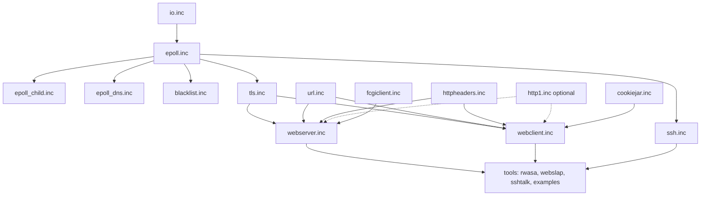

# HeavyThing Networking

Linux `epoll`-based, zero-libc networking stack layered from raw sockets through HTTP/1.x, TLS 1.2, and SSH2.

## Overview

The networking subsystem provides an event-driven IO foundation built directly on the Linux `epoll_create`, `epoll_ctl`, and `epoll_wait` syscalls (Source: /epoll.inc:22). Protocol modules (TLS, SSH, HTTP) layer on top of a virtual-method IO object chain so application code composes them declaratively rather than writing dispatch boilerplate. The stack is used by every networking-capable showcase in this repository — `rwasa` (web server), `webslap` (load tester), `sshtalk` (SSH chat), and the examples under `examples/echo`, `examples/tlsecho`, and `examples/sshecho`.

Protocol scope at a glance: HTTP/1.x only (no HTTP/2 or HTTP/3); TLS 1.2 only (no TLS 1.3); SSH version 2 only. The stack is Linux-specific — it does not abstract over kqueue, IOCP, or `io_uring`.

## Architecture Fit

The networking modules sit above the generic `io.inc` base object (Source: /io.inc:22) and below the application and tool layer. `ht.inc` enforces include order: `io.inc` loads first, then `epoll.inc`, then `epoll_child.inc`, then (later in the chain) `tls.inc` and `ssh.inc`, then `url.inc`, `httpheaders.inc`, `fcgiclient.inc`, `webserver.inc`, `cookiejar.inc`, and finally `webclient.inc` (Source: /ht.inc:157–208). `http1.inc` is a standalone optional module — it is not auto-included by `ht.inc`; HTTP/1.x parsing inside `webserver.inc` and `webclient.inc` is served by `httpheaders$parse_http1` and `httpheaders$tobuffer_http1` from `httpheaders.inc`.

Upward dependencies: this subsystem consumes `heap.inc`, `buffer.inc`, `list.inc`, `maps.inc` (data structures); `sha1.inc`, `sha2.inc`, `hmac.inc`, `aes.inc`, `rng.inc`, `bigint.inc`, `dh_pool.inc`, `X509.inc`, `htcrypt.inc` (crypto); `base64_latin1.inc`, `mimelike.inc`, `zlib_inflate.inc`, `zlib_deflate.inc` (utility primitives).

Downward consumers: `rwasa/`, `webslap/`, `sshtalk/`, `toplip/` (for upload mode), and every `examples/` program that opens a socket.



### IO Chaining Model

IO objects are doubly linked by `io_parent_ofs` and `io_child_ofs` (Source: /io.inc:40–43). The virtual-method slots at offsets `io_vdestroy`, `io_vclone`, `io_vconnected`, `io_vsend`, `io_vreceive`, `io_verror`, `io_vtimeout` (Source: /io.inc:47–54) are dispatched along the chain in two directions: `destroy`, `clone`, and `send` propagate **forward** (parent to child); `receive`, `connected`, `error`, and `timeout` propagate **backward** (child to parent) (Source: /io.inc:23–27). An object chain bound to the event loop must terminate in an `epoll` object; `epoll$inbound`, `epoll$outbound`, `epoll$outbound_hostname`, and `epoll$established` walk down the `io_child_ofs` pointers to find it (Source: /epoll.inc:1401–1418). TLS and SSH place themselves between the application object and the terminal `epoll` object so that encrypted bytes flow out and plaintext flows in transparently (Source: /tls.inc:38–47).

## Key Components

| File | Purpose |
|------|---------|
| `../io.inc` | Do-nothing IO base object. Defines vmethod table slots and parent/child pointer offsets that every networking module descends from |
| `../epoll.inc` | Core event-loop engine. Wraps `epoll_create`/`epoll_ctl`/`epoll_wait`; drives the main iteration via `epoll$run`; provides `epoll$inbound` (listener), `epoll$outbound`/`epoll$outbound_hostname` (connect), `epoll$established` (wrap existing fd), `epoll$send` (buffered write), and the timer API |
| `../epoll_child.inc` | Fork and inter-process helpers for multi-process master/worker tools; used by `rwasa` and `webslap` |
| `../epoll_dns.inc` | Asynchronous DNS resolver integrated into the event loop; included from `epoll.inc` |
| `../tls.inc` | Minimalist TLS 1.2 client and server. AES-128/256-CBC cipher suites with SHA1/SHA256 HMAC; PEM hot-reload; session cache |
| `../ssh.inc` | SSH version 2 client and server transport. `diffie-hellman-group-exchange-sha256` KEX; `ssh-rsa`/`ssh-dsa` host keys; `aes256-cbc` cipher; `hmac-sha2-256` MAC |
| `../http1.inc` | Optional HTTP/1.x message parser and builder. Standalone — not auto-included by `ht.inc`. Consumers must `include 'http1.inc'` themselves |
| `../httpheaders.inc` | HTTP header canonicalization tables. Provides `httpheaders$parse_http1` and `httpheaders$tobuffer_http1` used by `webserver.inc` and `webclient.inc` |
| `../url.inc` | URL parsing and normalization |
| `../cookiejar.inc` | HTTP cookie jar |
| `../fcgiclient.inc` | FastCGI client for backing PHP/Perl/other dynamic content behind the web server |
| `../blacklist.inc` | IP blacklist primitives used by the TLS and SSH error paths |
| `../webclient.inc` | High-level browser-style HTTP client with persistent connections, redirects, and DNS cache |
| `../webserver.inc` | HTTP/1.1 server with mmap file serving, gzip, HSTS, BREACH mitigation, and per-worker configuration |

## Calling Convention

The library-wide register contract is documented in [/docs/calling-convention.md](../docs/calling-convention.md). Networking entry points use System V AMD64 argument order unless noted. All entry labels follow the `subsystem$function` pattern (e.g., `epoll$send`, `tls$new`). Stack alignment is 16-byte at call boundaries, enforced by the `prolog` and `epilog` macros from `profiler.inc`.

### epoll entry points

`epoll$new` — constructor (Source: /epoll.inc:163).

- In: `rdi` = pointer to a 7-slot vmethod table; `esi` = extra private bytes to reserve at the end of the object
- Out: `rax` = newly allocated epoll object

`epoll$inbound` — bind and listen (Source: /epoll.inc:1405).

- In: `rdi` = `sockaddr` pointer; `rsi` = `sockaddr` length; `rdx` = epoll vmethod object (or the head of an io chain whose tail is the epoll object)
- Out: `rax` = 1 on success, 0 on bind or listen failure
- Behavior: walks down `io_child_ofs` to the terminal epoll object; applies `SO_REUSEADDR`, optional `SO_KEEPALIVE` and `TCP_NODELAY` per `ht_defaults.inc`

`epoll$outbound` — connect by resolved sockaddr (Source: /epoll.inc:1795).

- In: `rdi` = `sockaddr` pointer; `esi` = `sockaddr` length; `rdx` = epoll vmethod object
- Out: `rax` = 1 on success, 0 on failure

`epoll$outbound_hostname` — connect by hostname using async DNS (Source: /epoll.inc:2429).

- In: `rdi` = hostname string (buffer); `esi` = port; `rdx` = epoll vmethod object
- Behavior: on failure calls the chain's `io_verror` vmethod

`epoll$established` — wrap a pre-existing non-blocking fd (Source: /epoll.inc:2593).

- In: `rdi` = socket fd; `rsi` = epoll vmethod object
- Assumption: caller has already set non-blocking mode on the fd

`epoll$send` — buffered write (Source: /epoll.inc:590).

- In: `rdi` = epoll object; `rsi` = data pointer; `rdx` = length
- Behavior: attempts a direct `write(2)` first; any remainder is appended to the internal output buffer and `EPOLLOUT` is enabled so the kernel re-drives the write when the socket is writable

`epoll$run` — main event loop (Source: /epoll.inc:3495). Does not return under normal operation. Call once after all listeners are bound.

### IO vmethod slot layout

The vmethod table is 7 `dq` (pointer) slots. A networking application builds its vmethod table by copying `epoll$default_vtable` (Source: /epoll.inc:753) and replacing the slots whose defaults it wants to override (typically `io_vconnected` and `io_vreceive`).

| Offset | Slot | Dispatch direction |
|--------|------|--------------------|
| `io_vdestroy` = 0 | destructor | forward (parent → child) |
| `io_vclone` = 8 | clone | forward |
| `io_vconnected` = 16 | connection established | backward (child → parent) |
| `io_vsend` = 24 | send bytes | forward |
| `io_vreceive` = 32 | bytes received | backward |
| `io_verror` = 40 | error | backward |
| `io_vtimeout` = 48 | timer expiry | backward |

Handler register conventions:

- `io_vconnected` receives `rdi` = epoll object, `rsi` = sockaddr pointer, `edx` = sockaddr length (Source: /examples/echo/echo.asm:31–32).
- `io_vreceive` receives `rdi` = epoll object, `rsi` = data pointer, `rdx` = length. Return `0` in `eax` to keep the connection open, `1` to close it (Source: /examples/echo/echo.asm:47–64).

### epoll$send output-completion callbacks

`epoll$sendcb` (Source: /epoll.inc:2653) registers a two-stage callback for applications that need to know when the output buffer is in use and when it is drained:

- Stage 1 (`rdi` = arg, `esi` = 0): buffering has started because the kernel could not accept all bytes immediately.
- Stage 2 (`rdi` = arg, `esi` = 1): buffer is empty; it is safe to push more bytes (Source: /epoll.inc:49–76).

## Usage

Minimal TCP echo server — condensed from `examples/echo/echo.asm` (Source: /examples/echo/echo.asm:21–108). The three-file include contract `ht_defaults.inc` → `ht.inc` → `ht_data.inc` is mandatory and is visible at the top and bottom of the file.

```nasm
include '../../ht_defaults.inc'
include '../../ht.inc'

; receive handler: echo bytes back unchanged
falign
echo_received:
    prolog  echo_received
    push    qword [rdi+epoll_inbuf_ofs]   ; save inbuf ptr
    call    epoll$send                    ; rdi=obj, rsi=data, rdx=len already set
    pop     rdi
    call    buffer$reset                  ; clear inbuf so bytes do not re-accumulate
    xor     eax, eax                      ; 0 = keep connection open
    epilog

; vmethod table: copy of epoll$default_vtable with echo_received in the receive slot
dalign
echo_vtable:
    dq epoll$destroy, epoll$clone, io$connected, epoll$send, \
       echo_received, io$error, io$timeout

public _start
_start:
    call    ht$init
    mov     rdi, echo_vtable
    xor     esi, esi
    call    epoll$new                     ; rax = epoll object
    mov     rbx, rax
    sub     rsp, sockaddr_in_size
    mov     rdi, rsp
    mov     esi, 8001
    call    inaddr_any
    mov     rdi, rsp
    mov     esi, sockaddr_in_size
    mov     rdx, rbx
    call    epoll$inbound                 ; bind + listen
    call    epoll$run                     ; blocks; returns only on fatal error

include '../../ht_data.inc'
```

Build with FASM and GNU `ld`:

```bash
fasm -m 524288 echo.asm && ld -o echo echo.o
```

For a TLS-terminated variant, see `examples/tlsecho`; for SSH, see `examples/sshecho`; for a multi-process master/worker pattern, see `examples/multicore_echo`.

## Configuration

All compile-time knobs live in `ht_defaults.inc`. Values shown are defaults; override either by editing `ht_defaults.inc` directly or by defining a symbol **before** the include (the pattern used by `rwasa/tlsmin_defaults.inc` and `webslap/tlsmin_defaults.inc`).

### epoll and DNS

| Knob | Default | Meaning |
|------|---------|---------|
| `epoll_minfds` | 4096 | Minimum fd slot count required at startup; exits with code 97 if `RLIMIT_NOFILE` is lower |
| `epoll_multiple_accepts` | 1 | Accept multiple new connections per event-loop iteration |
| `epoll_keepalive` | 1 | Enable `SO_KEEPALIVE` on listener sockets |
| `epoll_linger` | 0 | Enable `SO_LINGER` |
| `epoll_linger_time` | 30 | Linger seconds when enabled |
| `epoll_nodelay` | 1 | Enable `TCP_NODELAY` |
| `epoll_fionbio` | 1 | Use `ioctl(FIONBIO)` rather than `fcntl(O_NONBLOCK)` |
| `epoll_stacksize` | 4096 | `epoll_wait` maxevents |
| `epoll_readsize` | 32768 | Per-connection read-buffer block size |
| `epoll_del_before_close` | 0 | Explicit `EPOLL_CTL_DEL` before `close` (fork/`CLOEXEC` edge case) |
| `epoll_outbound_cloexec` | 0 | `SOCK_CLOEXEC` on outbound sockets |
| `epoll_unixconnect_forgiving` | 1 | Queue `EAGAIN` connects for unix-domain sockets |
| `dns_timeout_msecs` | 10000 | DNS query timeout in milliseconds |

### TLS

| Knob | Default | Meaning |
|------|---------|---------|
| `tls_minimalist` | 0 | When set, restricts the cipher suite table to RSA/AES-128/CBC for maximum throughput (see `rwasa_tlsmin`, `webslap_tlsmin`) |
| `tls_server_cipher_order` | 1 | Honor server cipher preference |
| `tls_server_sessioncache` | 3600 | Session cache TTL in seconds |
| `tls_server_encryptcache` | 1 | Encrypt session cache entries with AES-256 |
| `tls_server_ocsp_stapling` | 1 | Enable OCSP stapling |
| `tls_server_rsa_blinding` | 0 | RSA blinding countermeasure for timing side channels |
| `tls_perfect_forward_secrecy_only` | 0 | Disable non-PFS cipher suites |
| `tls_pem_refresh_interval` | 3600 | Seconds between PEM-file mtime checks for certificate hot-reload |
| `tls_blacklist` | 86400 | Blacklist seconds applied on TLS handshake errors |
| `tls_clientside_dh_p_verify` | 0 | Client-side verification of server DH parameters |
| `tls_client_sessioncache` | 3600 | Client-side session cache TTL |
| `tls_client_encryptcache` | 1 | Encrypt client session cache |

### SSH

| Knob | Default | Meaning |
|------|---------|---------|
| `ssh_dh_dynamic` | 0 | `0` = use `dh_pool.inc` pre-generated groups; `1` = generate DH parameters on the fly |
| `ssh_do_compression` | 1 | Offer compression |
| `ssh_force_compression` | 1 | Require compression |
| `ssh_blacklist` | 86400 | Blacklist seconds on SSH errors |

### Web server

| Knob | Default | Meaning |
|------|---------|---------|
| `webserver_maxheader` | 32768 | Maximum request-header bytes |
| `webserver_maxrequest` | 67108864 | Maximum POST body (64 MiB) |
| `webserver_bigfile` | 33554432 | Large-file threshold (32 MiB) |
| `webserver_autogzip` | 1 | Gzip text responses on the fly |
| `webserver_filecache_time` | 300 | Seconds between mmap-file mtime rechecks |
| `webserver_initialsend` | 262144 | Initial send chunk size |
| `webserver_subsequentsend` | 262144 | Subsequent send chunk size |
| `webserver_hsts` | 1 | Emit `Strict-Transport-Security` header |
| `webserver_breach_mitigation` | 48 | Random `X-NB` header bytes to mitigate BREACH |
| `webserver_fastcgi_postprocess` | 0 | Post-process FastCGI responses |

### Web client

| Knob | Default | Meaning |
|------|---------|---------|
| `webclient_maxconns` | 4 | Maximum concurrent connections per hostname |
| `webclient_readtimeout` | 120000 | Per-response read timeout (ms) |
| `webclient_follow_redirects` | 1 | Follow 3xx redirects |
| `webclient_global_dnscache` | 1 | Share DNS resolutions across webclient instances |

## Limitations

- **Linux only.** Uses `epoll_create`/`epoll_ctl`/`epoll_wait` directly; there is no portability shim for kqueue, IOCP, or `io_uring`.
- **TLS 1.2 only.** No TLS 1.3. No ECDHE (design choice citing NIST curve concerns post-Snowden), no ChaCha20-Poly1305, no AEAD (CCM/GCM) suites. MAC is limited to CBC modes with SHA1/SHA256 HMAC (Source: /tls.inc:22–66).
- **X.509 handling is garbage-in garbage-out.** The TLS layer does not perform chain validation; whatever PEM is loaded is presented to peers as-is (Source: /tls.inc:31).
- **PEM hot-reload is leaky by design.** During reload, the old certificate memory is intentionally not freed to avoid quiescing active connections. This is a documented trade-off (Source: /tls.inc:53).
- **SSH version 2 only, narrow cipher set.** Only `diffie-hellman-group-exchange-sha256` KEX; only `ssh-rsa` and `ssh-dsa` host keys; only `aes256-cbc` cipher; only `hmac-sha2-256` MAC. No ed25519, no curve25519, no ChaCha20-Poly1305 (Source: /ssh.inc:27–37).
- **SSH client has no hostkey database.** The client verifies RSA/DSA signatures on host keys but does not pin them to a known-hosts file (Source: /ssh.inc:67–70).
- **HTTP/1.x only.** No HTTP/2, no HTTP/3, no WebSocket. Parsing is performed by `httpheaders$parse_http1` and `httpheaders$tobuffer_http1` from `httpheaders.inc`; the standalone `http1.inc` is optional and not auto-included by `ht.inc`.
- **Web server file cache is mtime-based, not size-aware.** If a file's size changes without an mtime change, responses can contain zero-padding or be truncated within one `webserver_filecache_time` window (Source: /webserver.inc:50–58). The documented workaround is to replace files atomically (delete-then-recreate rather than in-place rewrite).
- **Web client destructor must not be called from within a callback.** Schedule a 1-ms timer and call `webclient$destroy` from that timer handler instead (Source: /webclient.inc:39–41).
- **Subsystem-specific exit codes.** `96` = `epoll_create` failed; `97` = `epoll_minfds` not met at startup (Source: /ht.inc:38–42).

## See Also

- [/crypto/README.md](../crypto/README.md) — AES, SHA-1/2, HMAC primitives used by TLS and SSH
- [/ds/README.md](../ds/README.md) — `buffer.inc`, `maps.inc`, `list.inc` used for header tables, session caches, and DNS cache
- [/docs/architecture.md](../docs/architecture.md) — full include graph, subsystem boundaries, and init/event-loop lifecycle
- [/docs/calling-convention.md](../docs/calling-convention.md) — library-wide register contract, `prolog`/`epilog` macros, label naming
- [/docs/security.md](../docs/security.md) — TLS and SSH version/cipher matrix and operational security guidance
- [/docs/building.md](../docs/building.md) — FASM invocation and the three-file include contract
- [/rwasa/README.md](../rwasa/README.md) — `rwasa` web server showcase (HTTP + TLS + FastCGI)
- [/webslap/README.md](../webslap/README.md) — HTTP/HTTPS load tester
- [/sshtalk/README.md](../sshtalk/README.md) — SSH2 chat-server showcase
- [/examples/README.md](../examples/README.md) — `echo`, `tlsecho`, `sshecho`, `multicore_echo` worked examples

---

Licensed under GPL-3.0-or-later. See [/LICENSE](../LICENSE).
