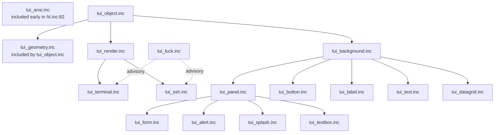

# HeavyThing Terminal UI

A pseudo-object-oriented widget framework for VT100/ANSI terminals and SSH pty
sessions, rendered through the library's epoll event loop
(Source: `../tui_object.inc:22–32`; `../tui_render.inc:22–27`;
`../tui_terminal.inc:22–26`; `../tui_ssh.inc:22–31`).

## Overview

The TUI subsystem is a pseudo-OOP widget hierarchy rooted in `../tui_object.inc`,
which provides a vtable-based inheritance model shared with the library's epoll
layer so that widgets can masquerade as epoll objects when their timer
functionality is exercised (Source: `../tui_object.inc:28–32`). Two top-level
renderers descend from `../tui_render.inc`: `../tui_terminal.inc` hooks stdin/stdout
with `SIGWINCH` handling for local terminals, while `../tui_ssh.inc` renders over an
SSH channel as an `io` descendent for io chaining
(Source: `../tui_terminal.inc:22–26`; `../tui_ssh.inc:22–31`). Redraws are
batched through `../tui_lock.inc` to avoid cascading `nvrender` calls within a
single `epoll$iteration`, which would otherwise be triggered on every keyevent
during text editing (Source: `../tui_lock.inc:22–38`). The subsystem ships 32
`tui_*.inc` modules covering containers, input widgets, display widgets, drawing
primitives, transition effects, authentication, and specialty renderers
(PNG-to-TUI, matrix rain, typist effect).

## Architecture Fit

The TUI subsystem does not bootstrap by itself. Callers must invoke `ht$init`
first, after which `tui_terminal$new` (or `tui_ssh$new` in the SSH case)
auto-registers with epoll so that the event loop drives widget redraws, timers,
focus events, and `SIGWINCH`-driven size changes
(Source: `../examples/tuimatrix/tuimatrix.asm:44–62`; `../tui_terminal.inc:255–266`).

Dependencies in:

| Dependency | Role |
|---|---|
| `../ht.inc`, `../ht_defaults.inc`, `../ht_data.inc` | Three-file include contract that must wrap every application (Source: `../ht.inc:22–36`) |
| `../epoll.inc` | Event dispatch for keyevents, timers, `SIGWINCH` (Source: `../tui_terminal.inc:22–26`) |
| `../buffer.inc`, `../unicodecase.inc` | Draw buffers and Unicode text handling (Source: `../tui_text.inc:22–32`) |
| `../heap.inc` | Every `tui_<widget>$new*` calls `heap$alloc` internally (Source: `../tui_terminal.inc:201–203`) |
| `../list.inc` | Child/particle lists for containers and effects (Source: `../tui_effect.inc:22–35`) |
| `../profiler.inc` | `prolog`/`epilog` macros used by every TUI function |

Dependencies out:

| Consumer | Composition |
|---|---|
| `../sshtalk/` | SSH-enabled multi-user chat using `tui_simpleauth`, `tui_splash`, `tui_ssh` |
| `../hnwatch/` | HackerNews terminal reader built on `tui_datagrid`, `tui_panel`, `tui_label`, `tui_statusbar` (Source: `../hnwatch/ui.inc:22–32`) |
| `../examples/tuimatrix/` | Canonical minimal TUI demo |
| `../examples/tuieffects/` | Effect-library transitions showcase |

Ordering constraints enforced by `../ht.inc`:

- `../tui_ansi.inc` is included at `../ht.inc:82`, BEFORE `../profiler.inc` at
  `../ht.inc:87`, because the profiler's internal TUI object needs the ANSI
  color macros declared first (Source: `../ht.inc:81–82`).
- The remaining 29 `tui_*.inc` files are included at `../ht.inc:173–201` in a
  specific order: base class → render pipeline → lock → top-level renderers →
  base presentation → drawing primitives → input widgets → containers → effects
  → specialty widgets → form → statusbar/newsticker. This load order reflects
  real compile-time dependencies and must not be reordered (Source: `../ht.inc:173–201`).
- `../tui_geometry.inc` is included BY `../tui_object.inc:34`, not by `../ht.inc`
  directly.
- `../tui_gridguts.inc` is included BY `../tui_datagrid.inc:313`, not by
  `../ht.inc` directly.

The summary diagram below shows the primary inheritance and composition
relationships. The detail diagram that follows covers specialty widgets,
drawing primitives, and the effects family.

```mermaid
graph TD
    tui_background.inc[tui_background.inc]
    tui_object.inc[tui_object.inc]
    tui_panel.inc[tui_panel.inc]
    tui_datagrid.inc[tui_datagrid.inc]
    tui_gridguts.inc[tui_gridguts.inc<br/>included by tui_datagrid.inc:313]
    tui_lines.inc[tui_lines.inc]
    tui_spinner.inc[tui_spinner.inc]
    tui_spacers.inc[tui_spacers.inc]
    tui_bell.inc[tui_bell.inc]
    tui_progressbar.inc[tui_progressbar.inc]
    tui_progressbox.inc[tui_progressbox.inc]
    tui_effect.inc[tui_effect.inc]
    tui_effects.inc[tui_effects.inc]
    tui_matrix.inc[tui_matrix.inc]
    tui_typist.inc[tui_typist.inc]
    tui_png.inc[tui_png.inc]
    tui_simpleauth.inc[tui_simpleauth.inc]
    tui_statusbar.inc[tui_statusbar.inc]
    tui_newsticker.inc[tui_newsticker.inc]

    tui_background.inc --> tui_lines.inc
    tui_background.inc --> tui_spinner.inc
    tui_object.inc --> tui_spacers.inc
    tui_object.inc --> tui_bell.inc
    tui_background.inc --> tui_progressbar.inc
    tui_panel.inc --> tui_progressbox.inc
    tui_object.inc --> tui_effect.inc
    tui_effect.inc --> tui_effects.inc
    tui_effect.inc --> tui_matrix.inc
    tui_effect.inc --> tui_typist.inc
    tui_background.inc --> tui_png.inc
    tui_object.inc --> tui_simpleauth.inc
    tui_background.inc --> tui_statusbar.inc
    tui_background.inc --> tui_newsticker.inc
    tui_datagrid.inc --> tui_gridguts.inc
```





## Key Components

The following table enumerates all 32 `tui_*.inc` modules. Purpose descriptions
are derived from each file's header comment block at lines 22–40. Rows are
grouped by role (infrastructure → drawing → widgets → containers → effects →
specialty).

| File | Purpose |
|---|---|
| `../tui_object.inc` | Base widget class; vtable/pseudo-OOP root for every TUI component |
| `../tui_geometry.inc` | Point/rect geometry helpers; included by `tui_object.inc` |
| `../tui_render.inc` | Rendering pipeline; ancestor of top-level renderers |
| `../tui_lock.inc` | Batches `nvrender` calls within one `epoll$iteration` |
| `../tui_terminal.inc` | Top-level renderer for local stdin/stdout with `SIGWINCH` handling |
| `../tui_ssh.inc` | Top-level renderer over an SSH channel (io-chained) |
| `../tui_ansi.inc` | ANSI color and escape-sequence macros |
| `../tui_background.inc` | Simple background component; ancestor of most widgets |
| `../tui_bell.inc` | 1x1 component that emits `0x07` bell on timer |
| `../tui_lines.inc` | Horizontal and vertical line widgets over `tui_background` |
| `../tui_spacers.inc` | Horizontal and vertical spacers for dynamic layouts |
| `../tui_spinner.inc` | Simple text spinner (`- \ \| /` by default) |
| `../tui_label.inc` | Static text label with multiline layout; requires `string_bits = 32` |
| `../tui_text.inc` | Feature-rich text display/editor (largest TUI module) |
| `../tui_button.inc` | Clickable button widget |
| `../tui_textbox.inc` | Panel wrapper with title, message, and single-line editor |
| `../tui_progressbar.inc` | Horizontal/vertical progress bar |
| `../tui_progressbox.inc` | Panel wrapper with title, message, and progress bar |
| `../tui_datagrid.inc` | JSON-array-driven data grid with selection and search |
| `../tui_gridguts.inc` | Private handlers for `tui_datagrid` (`prolog_silent`) |
| `../tui_panel.inc` | Bordered container with title and padded child area |
| `../tui_form.inc` | Form container with tab-order focus routing |
| `../tui_alert.inc` | Modal alert dialog built from panel, message, and buttons |
| `../tui_splash.inc` | 2 Ton Digital signature splash screen (embedded PNG) |
| `../tui_effect.inc` | Base particle-list effect for composition transitions |
| `../tui_effects.inc` | Collection of slide/distort/move effect variants |
| `../tui_matrix.inc` | Matrix-rain effect (heavy terminal load) |
| `../tui_typist.inc` | Typing/teletype animated text effect |
| `../tui_png.inc` | Renders PNG images as block characters |
| `../tui_simpleauth.inc` | Login/new-user auth screen with virtual methods |
| `../tui_statusbar.inc` | Single-line status bar with uptime and right-aligned items |
| `../tui_newsticker.inc` | Horizontal ticker-tape component |

## Calling Convention

For the library-wide register contract, stack-alignment expectations, and
`prolog`/`epilog` macro details, see `../docs/calling-convention.md`.
Subsystem-specific conventions follow.

Label naming pattern: every widget's public construction label follows the
`tui_<widget>$new<suffix>` form, where the suffix encodes the initial-geometry
style. Abstract bases (`tui_object`, `tui_render`) do not expose `$new`.

| Suffix | Argument Convention |
|---|---|
| `$new` | Default geometry; no geometry arguments |
| `$new_ii` | Integer x/y, integer width/height (absolute cells) |
| `$new_id` | Integer x/y, decimal (percentage) size |
| `$new_di` | Decimal position, integer size |
| `$new_dd` | Decimal position, decimal size |
| `$new_rect` | Pre-computed rect argument |
| `$new_str` | Initialized with a source string |

Representative constructors confirmed: `tui_panel$new_{rect,id,di,dd,ii}` at `../tui_panel.inc:311–414`; `tui_label$new_{ii,str,dd,id,di,rect}` at `../tui_label.inc:79–286`; `tui_form$new_{rect,id,di,dd,ii}` at `../tui_form.inc:72–168`; `tui_datagrid$new_{copy,rect,id,di,...}` at `../tui_datagrid.inc:83–294`.

Vtable pattern: each widget defines a `tui_<widget>$vtable` at a deterministic
offset, and a widget instance's first 8 bytes hold a pointer to this vtable
(Source: `../tui_object.inc:28–32`; `../tui_terminal.inc`, `tui_terminal$vtable`).
Because of a shared layout with the epoll layer's vmethod table, a TUI object
can answer the epoll timer interface without being an epoll object itself
(Source: `../tui_object.inc:30–32`).

Heap allocation: every `tui_<widget>$new*` label calls `heap$alloc` internally
and returns the new object's address in `rax`; callers do not pre-allocate
(Source: `../tui_terminal.inc:201–203`).

Prolog/epilog and symbol visibility: every TUI function uses `prolog <name>` /
`epilog` from `../profiler.inc`, maintaining the library-wide 16-byte stack
alignment on entry. Internal handlers in `../tui_gridguts.inc` use `prolog_silent`
so their names are not emitted to the symbol table
(Source: `../tui_gridguts.inc:22–30`).

Event routing: keyevents, timers, size-change events, and focus events are
dispatched by the top-level renderer (`tui_terminal` or `tui_ssh`) through the
child tree via the vtable's event-handler slots. The `tui_form` container
additionally routes tab and shift-tab focus changes
(Source: `../tui_form.inc:681`, `tui_form$ontab`; `../tui_form.inc:713`,
`tui_form$onshifttab`).

Redraw lock: code that calls `nvrender` directly must not do so from within an
epoll iteration; use `../tui_lock.inc` to defer the render to end-of-iteration,
which the `tui_terminal` and `tui_ssh` renderers do automatically
(Source: `../tui_lock.inc:22–38`).

## Usage

The minimal TUI program is 14 lines (Source: adapted from
`../examples/tuimatrix/tuimatrix.asm:1–64`; ordering constraint explained in
`../ht.inc:22–36` and `../ht_data.inc:22–30`).

```nasm
; Minimal TUI app: matrix rain inside tui_terminal.
; Build: fasm -m 524288 app.asm && ld -o app app.o
include '../ht_defaults.inc'            ; FIRST: config + format ELF64
include '../ht.inc'                     ; SECOND: library + 100+ submodules

public _start
_start:
    call    ht$init                      ; initialise the library
    call    tui_matrix$new               ; create a 100% x 100% widget
    mov     rdi, rax                     ; pass it as the only child
    call    tui_terminal$new             ; top-level renderer auto-registers with epoll
    call    epoll$run                    ; does not return

include '../ht_data.inc'                 ; LAST: seals .data section
```

`ht$init` bootstraps the library (CPU-feature detection, heap, vdso, epoll
setup — see `../docs/architecture.md`). `tui_matrix$new` heap-allocates a
matrix-rain widget sized to fill its parent. `tui_terminal$new` heap-allocates
the top-level renderer, appends the matrix widget as its only child, hooks
stdin/stdout via epoll, and installs `SIGWINCH` handling for terminal-resize
events (Source: `../tui_terminal.inc:22–26, 255–266`). `epoll$run` enters the
event loop and does not return.

## Configuration

The `../ht_defaults.inc` compile-time knobs that affect TUI behavior.

| Knob | Default | Purpose |
|---|---|---|
| `string_bits` | `32` | Native string width; TUI components require UTF32. Setting to `16` breaks most TUI widgets. |
| `terminal_alternatescreen` | `1` | Send `1049h`/`1049l` to enter/leave the alternate screen buffer (vim-style). |
| `tui_ssh_alternatescreen` | `1` | Same alternate-screen behavior for `tui_ssh` sessions. |
| `acs_linechars` | `1` | Translate Unicode line-drawing characters to VT100 ACS mode glyphs on the fly. |
| `tui_simpleauth_newuserfail_exit` | `0` | Whether a new-user registration failure exits the `tui_simpleauth` screen. |

Sources: `../ht_defaults.inc:102` (`string_bits`), `../ht_defaults.inc:221`
(`terminal_alternatescreen`), `../ht_defaults.inc:224` (`tui_ssh_alternatescreen`),
`../ht_defaults.inc:228` (`acs_linechars`), `../ht_defaults.inc:239`
(`tui_simpleauth_newuserfail_exit`).

Terminal dimensions are auto-detected via `TIOCGWINSZ` and updated on
`SIGWINCH` (Source: `../tui_terminal.inc:106, 255, 264, 266, 350`). For the
full list of build-time knobs see `../docs/building.md`.

## Limitations

- A VT100/ANSI-compatible terminal is required. Non-compatible terminals
  (Windows `cmd.exe` without VT support, strict line-mode terminals) are
  unsupported.
- `string_bits = 32` (UTF32) is required; setting `string_bits = 16` in
  `../ht_defaults.inc` breaks most TUI components
  (Source: `../ht_defaults.inc:101–102`; `../tui_label.inc:30`).
- `tui_matrix` is explicitly noted by the original author as bringing nearly
  every tested terminal program to 100% CPU due to half-width-kana rendering
  cost; raising its `max stream` parameter to ~1000 causes terminals to
  "totally FREAK OUT" in the author's own words
  (Source: `../tui_matrix.inc:24–35`).
- `tui_png` does not copy the source `png` object; callers must keep the PNG
  alive for the widget's lifetime (Source: `../tui_png.inc:26–30`).
- `tui_splash` adds approximately 18 KB of binary overhead because of its
  embedded splash-screen PNG (Source: `../tui_splash.inc:26`).
- `tui_simpleauth` composition: in a server environment, callers must not
  alter the primary three children of the auth screen, or the clone operation
  fails to find the mid/panel members (Source: `../tui_simpleauth.inc:32–36`).
- `tui_ssh` requires its next-in-chain `io` object to be an `ssh` object (or a
  careful intermediary muxer) because of its specialized callback handling for
  the SSH protocol (Source: `../tui_ssh.inc:26–31`).
- `tui_text` re-composes every line on resize, making it inefficient for very
  large (~512 MB) texts; no fileshadow/viewport optimization is implemented
  (Source: `../tui_text.inc:22–32`).
- Linux-only. The entire HeavyThing library targets Linux x86_64
  (see `../docs/architecture.md`).
- There is no automated test suite. Manual validation is performed via the
  worked examples and applications listed in the See Also section.

## See Also

Worked examples and applications:

| Path | Role |
|---|---|
| `../examples/tuimatrix/tuimatrix.asm` | Canonical minimal TUI demo (matrix rain) |
| `../examples/tuieffects/tuieffects.asm` | Cycles through `tui_effect`/`tui_effects` transitions |
| `../hnwatch/hnwatch.asm`, `../hnwatch/ui.inc` | HackerNews terminal reader composing datagrid, panel, label, statusbar |
| `../sshtalk/README.md` | SSH-hosted multi-user chat composing `tui_simpleauth`, `tui_splash`, `tui_ssh` |

Related subsystems and references:

| Path | Topic |
|---|---|
| `../net/README.md` | epoll event loop and SSH layer that TUI uses for io and event dispatch |
| `../ds/README.md` | `list`, `buffer`, `heap` data structures underpinning TUI widgets |
| `../docs/architecture.md` | Full include-graph, lifecycle, and exit codes |
| `../docs/calling-convention.md` | Register contract, `prolog`/`epilog`, label-naming convention |
| `../docs/security.md` | SSH/TLS posture for `tui_ssh`-based deployments |

---

Licensed under GPLv3. See [`../LICENSE`](../LICENSE).
